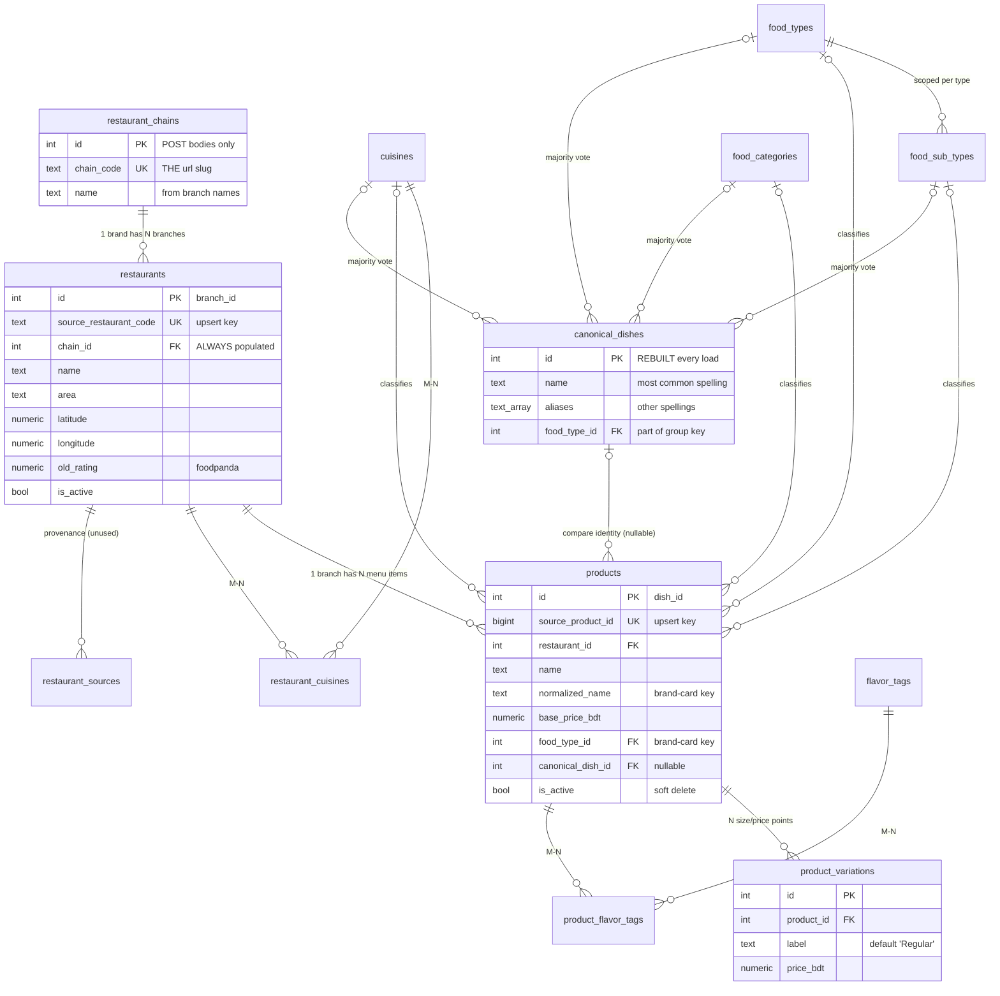
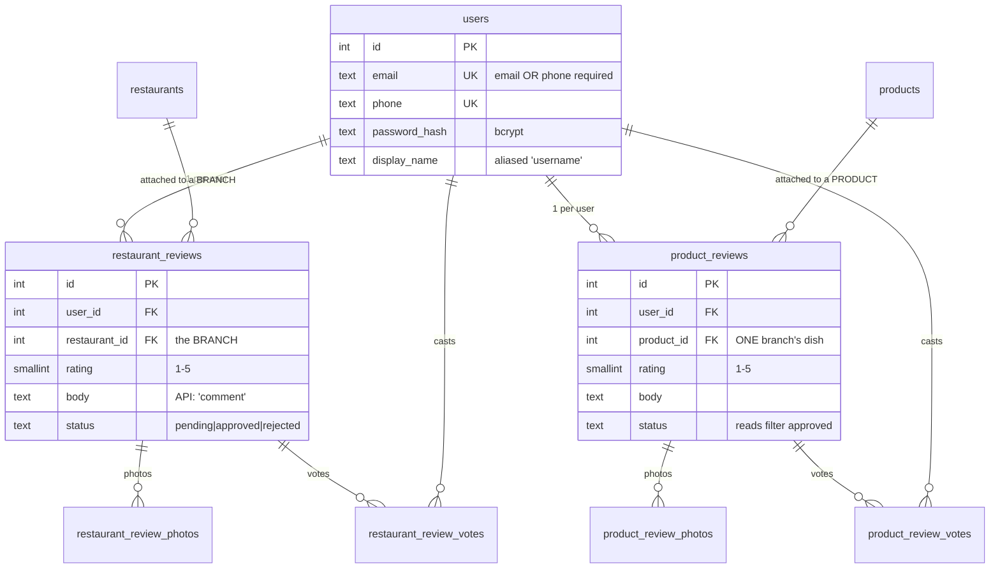

# Khawon Backend — Database, Schema & Algorithms

**Written:** 2026-07-17 · **Audience:** co-creators who already know the product.
**What this is:** how the backend is structured — every table, every column, and the algorithms that turn a foodpanda scrape into "search a dish, compare it across restaurants." Everything here was verified against the source code and the live Railway database on the date above.

**How to read it:** §1 is the vocabulary — 3 minutes, and nothing else parses without it. §2 is the complete schema. §3 is the algorithms, and ends with [§3.6](#36-end-to-end-a-real-dish-through-the-whole-system), a real dish traced through the entire system. §4 onward is supporting reference.

**Companion docs:** [`HANDOFF.md`](HANDOFF.md) — how to run things + 7 debugging traps (read §9 there before touching `load_batch.py`). [`specs/2026-07-15-chain-brand-model-design.md`](superpowers/specs/2026-07-15-chain-brand-model-design.md) — brand-model decisions D1–D14 with the data behind them.

---

## Contents

**Part I — The data**
1. [Vocabulary & the two-layer model](#1-vocabulary--the-two-layer-model)
2. [Tables & schema](#2-tables--schema) — [ER diagrams](#21-entity-relationships) · [conventions](#22-conventions) · [taxonomy](#23-taxonomy--lookup-tables) · [brands/branches](#24-brand--branch-tables) · [menu](#25-menu-tables) · [canonical dishes](#26-canonical_dishes--the-compare-layer) · [users & reviews](#27-users) · [views](#29-views) · [indexes](#210-indexes--extensions) · [changing the schema](#211-changing-the-schema)

**Part II — The algorithms**

3. [Algorithms & methods](#3-algorithms--methods) — [food types & sub types](#31-food-types--sub-types-classification) · [brands & restaurants](#32-brands--restaurants-chain-identity) · [canonical dishes](#33-canonical-dishes-the-compare-identity) · [comparing dishes](#34-comparing-dishes-brand-cards-search-compare) · [ratings](#35-ratings-pooling--the-display-rule) · [end-to-end trace](#36-end-to-end-a-real-dish-through-the-whole-system)

**Part III — Reference**

4. [Design principles](#4-design-principles) · 5. [Python layer](#5-the-python-layer) · 6. [Pipeline mechanics](#6-pipeline-mechanics-load_batchpy) · 7. [API reference](#7-api-reference) · 8. [Auth](#8-auth) · 9. [Services & env](#9-external-services--environment-variables) · 10. [Testing](#10-testing) · 11. [Gaps](#11-known-gaps--deferred-work)

---

# Part I — The data

## 1. Vocabulary & the two-layer model

Five nouns cover the entire data model.

| Term | Table | What it is |
|---|---|---|
| **Brand** | `restaurant_chains` | The identity a diner recognizes: *Domino's Pizza*. **In the API, "restaurant" means brand.** |
| **Branch** (location) | `restaurants` | One physical outlet: *Domino's Pizza - Dhanmondi*. Has coords, address, its own foodpanda rating. |
| **Product** | `products` | One menu item **at one branch**: *Margherita at Domino's Dhanmondi, 348tk*. |
| **Variation** | `product_variations` | A size/option price point on one product: *Margherita — Large — 649tk*. |
| **Canonical dish** | `canonical_dishes` | A cross-**brand** comparison identity: *"French Fries" as sold by 61 different brands*. |

Plus one thing that is **derived, never stored**:

| Term | Built by | What it is |
|---|---|---|
| **Brand dish card** | `brand_dishes.py`, at read time | A brand's branches collapsed into one menu entry: *Margherita at Domino's, 199–348tk, at 3 of 3 branches*. There is deliberately **no table** for this ([§4.3](#43-aggregate-at-read-time-store-no-derived-state)). |

### 1.1 Two grouping layers that stack

The single most confusing thing in this codebase is that there are **two** dedupe/grouping layers doing **different jobs**:

| Layer | Job | Scope | Example |
|---|---|---|---|
| **Chain grouping** (brand cards) | Dedupe *within* one brand | intra-brand | Domino's Margherita at 3 branches → **1 card** |
| **Canonical dish** | Compare *across* brands | inter-brand | French Fries at **61 different brands** |

They were originally conflated: canonical promotion counted *branches*, so a chain-exclusive item sold at 3 branches of one chain looked "comparable across restaurants" when nobody else makes it. Fixing promotion to count **brands** dropped canonical dishes 2,527 → 1,431. Those 1,096 weren't lost — they were the chain layer's job misfiled into the canonical layer, and they're still fully searchable. They just stopped pretending to be comparisons.

### 1.2 The load-bearing invariant: every restaurant is a brand

Every `restaurants` row has a `chain_id`. No exceptions. A standalone restaurant is *a brand of one* (`branch_count == 1`). Live: **451 branches → 378 brands** (53 multi-location, 325 solo).

Why it matters: every query is a plain `GROUP BY chain_id` with **zero** `if chain else standalone` branching. A solo restaurant's card, page, and menu are shape-identical to a chain's. When you add a feature, keep it that way.

---

## 2. Tables & schema

**20 tables + 3 views.** PostgreSQL 18 on Railway. Extension: `pg_trgm`. PostGIS is **not** available on Railway — geo is an optional add-on ([§2.11](#211-changing-the-schema)).

### 2.0 Live row counts (verified 2026-07-17)

| Table | Rows | | Table | Rows |
|---|---:|---|---|---:|
| `restaurants` | 451 | | `cuisines` | 11 |
| `restaurant_chains` | 378 | | `food_categories` | 6 |
| `products` | 16,402 *(16,385 active)* | | `flavor_tags` | 9 |
| `product_variations` | 20,643 | | `product_flavor_tags` | 14,857 |
| `canonical_dishes` | 1,431 | | `restaurant_cuisines` | 409 |
| `food_types` | 28 | | `restaurant_sources` | 0 *(defined, unused)* |
| `food_sub_types` | 111 | | `users` + all 6 review tables | 0 *(pre-launch)* |

> **Sub-type linking is live** (fixed + reloaded 2026-07-17). `food_sub_type_id` is set on **13,712 / 16,385** products and **1,184 / 1,431** canonical dishes — exactly matching the pipeline's own sub_type coverage, so every remaining NULL is a source row with no `sub_type`, not a dropped link. All 111 sub types carry products. History: [§3.1](#31-food-types--sub-types-classification).

Derived at read time: **13,653 brand-dish cards** from 16,385 active products — ~17% of the catalogue was chain duplication, collapsed per request.

### 2.1 Entity relationships

Split into two diagrams for readability. **Catalogue** first — this is the part you'll work in:



**Users & reviews** — two parallel stacks with identical shape:



The relationship that surprises people: **reviews attach to branches/products, never to brands.** Brand-level ratings are pooled at read time ([§3.5](#35-ratings-pooling--the-display-rule)).

### 2.2 Conventions

Read once, applies everywhere:

- **`id`** — `SERIAL` (`SMALLSERIAL` for small lookups) PK. Internal only; churns on reload for rebuilt tables.
- **Natural keys** — `UNIQUE` columns from the source (`source_product_id`, `source_restaurant_code`, `chain_code`). These are the upsert identity and are **stable across reloads** — use them for anything durable.
- **`created_at` / `updated_at`** — `TIMESTAMPTZ DEFAULT NOW()`. `updated_at` is maintained by the ORM (`onupdate`), **not** a DB trigger — raw-SQL writes won't touch it.
- **`status`** on reviews — `pending | approved | rejected` (CHECK). All public reads filter `approved`.
- **FK policy** — `ON DELETE SET NULL` for classification (losing a food type shouldn't delete products); `ON DELETE CASCADE` for ownership (deleting a product deletes its variations and reviews).
- **Money** — `NUMERIC(10,2)`, BDT, columns end `_bdt`.

### 2.3 Taxonomy & lookup tables

Four **independent dimensions**, each a nullable single FK on `products` — deliberately single-valued, so classification is one decision per dimension per product. The algorithm that assigns them is [§3.1](#31-food-types--sub-types-classification).

1. **Category** (`food_categories`, 6) — meal role: Breakfast / Main Dish / Appetizer / Sides / Dessert / Drinks.
2. **Food Type** (`food_types`, 28) — deliberately **coarse** browsing umbrellas: Rice, Curry, Pizza, Burger, Beverages, Set Menu… Coarse is a feature: 28 tiles fit a browse screen; 300 wouldn't.
3. **Food Sub Type** (`food_sub_types`, 111) — the *natural differentiator within each type*, which **differs per type**: protein for Curry, format for Rice (Biryani/Kacchi, Fried Rice, Tehari), preparation for Momo/Dumpling (Fried, Soup), drink kind for Beverages.
4. **Cuisine** (`cuisines`, 11) — Bangladeshi / Indian / Chinese / Italian…; "Asian" is a catch-all **only** for genuinely pan-Asian formats, not a dumping ground.

#### `cuisines` · `food_categories`
| Column | Type | Notes |
|---|---|---|
| `id` | SMALLSERIAL PK | |
| `name` | TEXT NOT NULL UNIQUE | Rows created on demand by `load_batch` from pipeline output. |

#### `food_types`
| Column | Type | Notes |
|---|---|---|
| `id` | SMALLSERIAL PK | Part of the brand-card grouping key **and** brand-dish URLs. |
| `name` | TEXT NOT NULL UNIQUE | e.g. `Pizza`, `Set Menu`. |

Deliberately a **bare** `(id, name)` lookup. v1 had image/description/parent columns; dropped when the "rich browsable entity" role moved to `canonical_dishes`. The API still *accepts* description/image on create/update (backward compat) but doesn't persist them, and the photo endpoint returns **501**.

#### `food_sub_types`
| Column | Type | Notes |
|---|---|---|
| `id` | SMALLSERIAL PK | |
| `food_type_id` | SMALLINT NOT NULL FK → food_types, CASCADE | Sub-types are **scoped under** a type — the same name can exist under two types. |
| `name` | TEXT NOT NULL | `UNIQUE (food_type_id, name)`. |

#### `flavor_tags`
| Column | Type | Notes |
|---|---|---|
| `id` | SMALLSERIAL PK | |
| `slug` | TEXT NOT NULL UNIQUE | e.g. `cheesy`, `smoky_bbq` — from the classifier. |
| `label` | TEXT NOT NULL | Display text; `load_batch` derives it (`smoky_bbq` → `Smoky Bbq`). |

9 tags, 14,857 product links. The API's `FlavorTagOut` exposes `label` under the field name `name` (the slug isn't exposed).

### 2.4 Brand & branch tables

#### `restaurant_chains` — the BRAND
| Column | Type | Notes |
|---|---|---|
| `id` | SERIAL PK | `chain_id` in code. **POST bodies only — never in URLs.** |
| `chain_code` | TEXT NOT NULL UNIQUE | **The brand slug and API URL key** (`domino-s-pizza`). Written by `bootstrap_chains.py` → `load_batch`. All 378 match `^[a-z0-9-]+$`. User-created brands get `user-<slug>-<8 hex>`. *(Named for the foodpanda "chain code" it once held; it has meant "brand slug" since the brand model landed.)* |
| `name` | TEXT NOT NULL | Display name, derived from **branch names** with location stripped case-preservingly ([§3.2](#32-brands--restaurants-chain-identity)). The scraped `chain_name` is deliberately unused — it's contaminated. |

Orphan rows (nothing points at them) are deleted at the end of every load — brands are re-derived each load.

#### `restaurants` — the BRANCH (location)
| Column | Type | Notes |
|---|---|---|
| `id` | SERIAL PK | The `branch_id` in POST bodies and `/branches/*` URLs. |
| `source_restaurant_code` | TEXT NOT NULL UNIQUE | Natural key from the scrape (e.g. `acks`); upsert identity. `user-…` prefix = user-contributed. |
| `name` | TEXT NOT NULL | Branch name as scraped, often with area suffix (`Waffle Up - Dhanmondi`). |
| `address` | TEXT NULL | |
| `latitude` / `longitude` | NUMERIC(10,8) / (11,8) | Populated for all 451. Raw for display/export; the derived `geog` column lives in the geo add-on only. |
| `rating` / `review_count` | NUMERIC(2,1) / INTEGER | ⚠️ **Reserved, NOT maintained** ([§4.3](#43-aggregate-at-read-time-store-no-derived-state)). Don't read them. |
| `old_rating` / `old_review_count` | NUMERIC(2,1) / INTEGER | The **foodpanda scraped** rating — the cold-start fallback in `display_rating` ([§3.5](#35-ratings-pooling--the-display-rule)). |
| `budget_tier` | SMALLINT CHECK 1–3 | 1 = cheap, 3 = expensive. From the source. |
| `phone` | TEXT NULL | |
| `city` | TEXT NOT NULL DEFAULT 'Dhaka' | |
| `area` | TEXT NULL | Dhanmondi / Gulshan / Uttara — derived from the **scrape batch filename**, not geocoding. |
| `chain_id` | INTEGER FK → restaurant_chains, SET NULL | Nullable in DDL but **always populated** in practice ([§1.2](#12-the-load-bearing-invariant-every-restaurant-is-a-brand)). |
| `hero_image_url` / `logo_image_url` | TEXT NULL | From the scrape; hero also settable via branch admin (Cloudinary). |
| `google_place_id` | TEXT NULL | **NULL for all 451** — `match_google_places.py` output was never merged. Deferred to the map feature. |
| `match_status` | TEXT CHECK | `unmatched \| auto_matched \| needs_review \| manually_matched \| rejected` — Google-Places matching state, **not** review moderation. |
| `is_active` | BOOLEAN DEFAULT TRUE | Every query filters on it. |
| `created_at` / `updated_at` | TIMESTAMPTZ | |

#### `restaurant_cuisines` — M:N branch ↔ cuisine
`restaurant_id` FK CASCADE + `cuisine_id` FK CASCADE, composite PK. Rebuilt (delete + insert) for the batch's restaurants on every load. Cuisine attaches at **branch** level (that's how the source provides it) *and* at product level as a single FK; brand-level cuisine lists are unioned at read time.

#### `restaurant_sources` — scrape provenance *(defined, 0 rows)*
`id` PK · `restaurant_id` FK CASCADE · `source_name` (e.g. `foodpanda`; `UNIQUE (restaurant_id, source_name)`) · `source_url` · `last_scraped_at` · `raw_metadata` JSONB *(escape hatch for extra source fields without schema churn)*.

Designed for multi-source provenance; `load_batch` doesn't populate it. Harmless empty; use it when a second source appears.

### 2.5 Menu tables

#### `products` — one menu item at ONE branch
| Column | Type | Notes |
|---|---|---|
| `id` | SERIAL PK | The `dish_id` in dish URLs/POST bodies. |
| `source_product_id` | BIGINT NOT NULL UNIQUE | Natural key from the scrape; upsert identity. Verified globally unique in real data. |
| `restaurant_id` | INTEGER NOT NULL FK → restaurants, CASCADE | The branch. |
| `name` | TEXT NOT NULL | Raw menu spelling, post-consolidation. |
| `description` | TEXT NULL | 100% populated currently. |
| `base_price_bdt` | NUMERIC(10,2) NOT NULL CHECK ≥ 0 | The "from" price = cheapest variation. |
| `image_url` | TEXT NULL | ~90% populated. Some foodpanda URLs carry a `?width=%s` template — patched at read time. |
| `is_sold_out` | BOOLEAN DEFAULT FALSE | Point-in-time from the scrape. |
| `category_id` / `cuisine_id` / `food_type_id` / `food_sub_type_id` | SMALLINT FK SET NULL | The four dimensions ([§2.3](#23-taxonomy--lookup-tables)). Live population: `food_type_id` **100%** (and part of the brand-card key), `category_id` 100%, `cuisine_id` 86%, `food_sub_type_id` **84%** (13,712 / 16,385 — the rest have no `sub_type` in the source; [§3.1](#31-food-types--sub-types-classification)). |
| `canonical_dish_id` | INTEGER FK → canonical_dishes, SET NULL | NULL = not comparable across brands — still fully searchable. |
| `normalized_name` | TEXT NULL *(indexed)* | **The brand-card grouping key** ([§3.4](#34-comparing-dishes-brand-cards-search-compare)), written by `load_batch` via `canonical_match_key()`. |
| `is_active` | BOOLEAN DEFAULT TRUE | **Soft delete** ([§4.5](#45-soft-delete-for-products-union-with-badge-for-availability)). |
| `last_seen_at` | TIMESTAMPTZ | Touched by every load that sees the product. |
| `rating` / `review_count` | | ⚠️ **Reserved, NOT maintained.** |
| `created_at` / `updated_at` | TIMESTAMPTZ | |

#### `product_variations` — size/option price points
| Column | Type | Notes |
|---|---|---|
| `id` | SERIAL PK | |
| `product_id` | INTEGER NOT NULL FK CASCADE | |
| `label` | TEXT NOT NULL DEFAULT 'Regular' | `UNIQUE (product_id, label)`. Defaults to `'Regular'` rather than NULL **on purpose**: Postgres treats NULLs as distinct under UNIQUE, so `UNIQUE(product_id, NULL)` would *not* block duplicate default rows. |
| `price_bdt` | NUMERIC(10,2) NOT NULL CHECK ≥ 0 | |
| `sort_order` | SMALLINT DEFAULT 0 | Source order. |

Rebuilt (delete + insert) each load — variations have no natural key of their own. The delete and the rebuild are both **scoped to the batch's restaurants** (`restaurant_id = ANY(batch_rest_ids)`); the two must stay in lockstep. They drifted once: the rebuild loop resolved product ids through a map seeded from *every* row in the DB, so a **partial glob** re-inserted out-of-batch variations the batch-scoped delete never removed → `UNIQUE (product_id, label)` violation. Fixed 2026-07-17 by skipping out-of-batch products in the rebuild loop (not widening the delete, which would wipe restaurants the batch never loaded). Pinned by `tests/test_load_batch_partial_glob.py`; see [`HANDOFF.md` §9 trap 8](HANDOFF.md).

#### `product_flavor_tags` — M:N product ↔ flavor tag
Composite PK `(product_id, flavor_tag_id)`, both CASCADE. Rebuilt each load.

### 2.6 `canonical_dishes` — the compare layer

The cross-brand comparison identity. **Fully rebuilt every load** (links nulled → table wiped → reinserted), which is why canonical ids must never be persisted anywhere. Algorithm: [§3.3](#33-canonical-dishes-the-compare-identity).

| Column | Type | Notes |
|---|---|---|
| `id` | SERIAL PK | Used in `/dishes/compare/{id}` — safe only because search hands the id to compare within one session. Never store it. |
| `name` | TEXT NOT NULL | Display name = most common raw spelling among members. |
| `aliases` | TEXT[] NOT NULL DEFAULT '{}' | Other observed spellings; GIN-indexed and searched. Also the landing zone for future LLM/pgvector spelling unification — fillable with no schema change. |
| `food_type_id` | SMALLINT FK SET NULL | Part of the group key. **Sub-type is deliberately NOT in the key** — the classifier disagrees on sub_type across restaurants for the same dish (Beef Tehari: "Tehari" here, "Biryani" there) and would fragment groups. |
| `food_sub_type_id` / `cuisine_id` / `category_id` | SMALLINT FK SET NULL | **Majority vote** across members — one stable value, so a dish doesn't flicker in/out of a filter when classifiers disagree per-restaurant. Products keep their own raw values. Live: `category_id` 100%, `cuisine_id` 94%, `food_sub_type_id` **83%** (1,184 / 1,431 — the rest have no `sub_type` in the source; [§3.1](#31-food-types--sub-types-classification)). |
| `image_url` | TEXT NULL | Fallback only; search serves a random image from the member pool. |
| `created_at` | TIMESTAMPTZ | |

### 2.7 `users`

| Column | Type | Notes |
|---|---|---|
| `id` | SERIAL PK | JWT `sub` claim. |
| `email` | TEXT UNIQUE NULL | CHECK: email OR phone must be present. |
| `phone` | TEXT UNIQUE NULL | Schema supports phone signup; API implements email only. |
| `password_hash` | TEXT NOT NULL | bcrypt. ORM exposes a read-only `hashed_password` alias. |
| `display_name` | TEXT NOT NULL | ORM exposes a read-only `username` alias. Uniqueness is **app-side only** — no DB constraint; a race could duplicate it. |
| `is_active` | BOOLEAN DEFAULT TRUE | Not yet checked at login ([§11](#11-known-gaps--deferred-work)). |
| `created_at` / `updated_at` | TIMESTAMPTZ | |

### 2.8 The two review stacks (parallel by design)

Two separate stacks answering different questions:

- **`restaurant_reviews`** — "how was the *experience* at this **location**?" Attached to a **branch**; displayed pooled per brand, tagged with the branch.
- **`product_reviews`** — "how was this **dish** at this branch?" Attached to a **product** row.

Shared rules:

- **Account required.** One review per user per target (`UNIQUE (user_id, restaurant_id)` / `UNIQUE (user_id, product_id)`) — resubmitting **updates** rather than stacking.
- **Post-moderation:** inserts write `status='approved'`, visible immediately; all reads and rating math filter `approved`. Switching to pre-moderation = default `'pending'` + build a queue. Nothing else changes.
- Ratings **computed live** from approved reviews.

#### `restaurant_reviews` / `product_reviews`
| Column | Type | Notes |
|---|---|---|
| `id` | SERIAL PK | |
| `user_id` | INTEGER NOT NULL FK users CASCADE | |
| `restaurant_id` / `product_id` | INTEGER NOT NULL FK CASCADE | The target. **This cascade is why products soft-delete.** |
| `rating` | SMALLINT NOT NULL CHECK 1–5 | |
| `body` | TEXT NULL | Exposed as `comment` in the API. |
| `status` | TEXT CHECK, DEFAULT 'pending' | App writes `'approved'`. |
| `is_verified_visit` / `is_verified_order` | BOOLEAN DEFAULT FALSE | Future badge; exposed as `is_verified`. |
| `helpful_count` / `not_helpful_count` | INTEGER DEFAULT 0 | Denormalized tallies — **not yet maintained**; the votes tables are the truth when voting ships. |
| `created_at` / `updated_at` | TIMESTAMPTZ | |

#### `*_review_photos` · `*_review_votes`
Photos: `id` PK · `review_id` FK CASCADE · `image_url` NOT NULL · `sort_order` · `created_at`.
Votes: composite PK `(review_id, user_id)` — one vote per user per review · `is_helpful` BOOLEAN NOT NULL · `created_at`.
Both schema-ready; no endpoints yet.

### 2.9 Views

`v_restaurant_summary`, `v_product_detail`, `v_canonical_dish_comparison` — defined at the bottom of `schema.sql`, handy for ad-hoc `psql` inspection (`v_canonical_dish_comparison` is the raw shape of the compare feature). **The API does not use them**; it builds richer shapes in Python. ⚠️ The first two expose the *reserved* stored rating columns, so their `rating` fields read NULL/0 — trust the API's computed ratings, not the views'.

### 2.10 Indexes & extensions

| Index | Serves |
|---|---|
| `idx_products_name_trgm`, `idx_restaurants_name_trgm`, `idx_canonical_dishes_name_trgm` (GIN, `gin_trgm_ops`) | The `ILIKE '%q%'` searches. **pg_trgm is why substring search is fast** — a btree cannot serve infix `LIKE`. |
| `idx_canonical_dishes_aliases` (GIN on TEXT[]) | Alias matching in search. |
| `idx_products_normalized_name` (btree) | Brand-card grouping / brand-dish detail. |
| `idx_products_restaurant`, `idx_products_canonical_dish`, `idx_restaurants_chain` | The three hot joins: branch menu, compare, brand's branches. |
| `idx_products_active`, `idx_products_sold_out` (partial) | The `WHERE is_active` on nearly every product query. |
| `idx_products_category/_food_type/_price/_rating`, `idx_restaurants_city/_area/_rating` | Browse/filter paths (some speculative, cheap to keep). |
| Review indexes on `restaurant_id`/`product_id`/`user_id`/`status` | Rating aggregation, "my review" lookups. |

### 2.11 Changing the schema

**`schema.sql` builds FRESH databases. `migrations/` brings EXISTING ones up to date.** No Alembic, on purpose: Postgres-native features + a re-derivable catalogue made it overhead. But "reset and reload" stops being safe the moment there's one real user, so:

> **Every schema change goes in BOTH places**: edit `schema.sql`, *and* add a new numbered, idempotent (`IF NOT EXISTS`) file in `migrations/`. Apply: `psql "$DATABASE_PUBLIC_URL" -f migrations/NNN_name.sql`. Currently one exists: `001_products_normalized_name.sql`.

**Geo is an optional add-on, not a migration.** `schema_geo.sql` adds `CREATE EXTENSION postgis`, a generated `geog GEOGRAPHY(Point,4326)` from lat/long, and a GiST index — enabling `ST_DWithin` radius and `ORDER BY geog <-> point` nearest-first. Railway has **no PostGIS** (verified), so `schema.sql` stays portable and geo applies only on a PostGIS host. Coords are already populated for all 451, so it's purely additive.

⚠️ Adding a **product column the pipeline writes** means touching FIVE hardcoded lists in `load_batch.py`, and missing one fails *silently*. Read [`HANDOFF.md` §9 trap 1](HANDOFF.md) first.

---

# Part II — The algorithms

## 3. Algorithms & methods

Five algorithms do the real work. They run in two different places, and the distinction matters:

| | Runs | Where | Output |
|---|---|---|---|
| [§3.1](#31-food-types--sub-types-classification) Classification | Offline, per load | `classify_batch.py` | `products.food_type_id` etc. |
| [§3.2](#32-brands--restaurants-chain-identity) Brand identity | Offline, per load | `bootstrap_chains.py` | `restaurant_chains` rows |
| [§3.3](#33-canonical-dishes-the-compare-identity) Canonical dishes | Offline, per load | `bootstrap_canonical_dishes.py` | `canonical_dishes` rows |
| [§3.4](#34-comparing-dishes-brand-cards-search-compare) Brand cards / search / compare | **Per request** | `brand_dishes.py`, `dish_detail.py` | `BrandDishOut` cards |
| [§3.5](#35-ratings-pooling--the-display-rule) Rating resolution | **Per request** | `restaurant_reviews.py` | `display_rating` trio |

### 3.0 The one function to understand first: `canonical_match_key()`

Lives in `bootstrap_canonical_dishes.py`. **It is the shared vocabulary of the entire system** — three separate layers import it, which is what makes them agree on what "the same dish name" means.

```
canonical_match_key("Chicken Biriyani (Half) - 500gm")
  1. normalize_name    strip size tokens, punctuation, prefixes
                       → "chicken biriyani"
  2. spelling map      phrase normalizations, then per-token SPELLING_MAP
                       biriyani→biryani, pulao→polao, cookies→cookie, kabab→kebab
                       → "chicken biryani"
  3. stopword removal  drop with/and/the/a/an/of
  4. token sort        → "biryani chicken"      ← the key
```

Token-sorting means "Chicken Biryani" and "Biryani Chicken" produce the same key. The three consumers:

| Consumer | Uses it for |
|---|---|
| `consolidate_variants.py` | Merging one restaurant's size-rows |
| `load_batch.py` | Writing `products.normalized_name` → **the brand-card key** |
| `bootstrap_canonical_dishes.py` | Grouping products into canonical dishes |

**Extend `SPELLING_MAP` and all three layers inherit it on the next load.** That is the intended way to improve matching today.

---

### 3.1 Food types & sub types (classification)

**Where:** `classify_batch.py` (~1,120 lines, lives in the data folder — see [§11](#11-known-gaps--deferred-work)). It's a keyword/regex classifier — an explicit stand-in for eventual LLM classification, built so the taxonomy could be validated against real data first.

#### The algorithm

```
classify_product(name, category_raw, description, restaurant_cuisines, restaurant_name)
│
├─ 1. is_non_food_item()?          → drop (7 rows dropped from 16,925 scraped)
├─ 2. is_combo_item()?             → classify_combo()   [short-circuits everything below]
└─ 3. classify_standalone()
      │
      ├─ Tier 1: match_food_type(name + category_raw)     ← FIRST
      ├─ Tier 2: match_food_type(name + category_raw + description)  ← fallback only
      ├─ Tier 3: protein_curry_fallback(text)             ← bare protein, no format
      ├─ Tier 4: category_raw section signals             ← last resort
      └─ Tier 5: restaurant-name namesake                 ← guarded
```

**Every step exists because of a real bug. The reasoning:**

**Rule order = the "format wins over garnish" principle.** `match_food_type` walks `FOOD_TYPE_RULES` (a `(food_type, sub_type, [regex])` list) and **the first match wins**. So the *order of the list is the algorithm*:

- Rice patterns sit **before** Kebab patterns → `"Chicken Dum Biryani with Egg & Jali Kebab"` → **Rice**, not Kebab.
- Wraps & Rolls **before** Kebab → `"Chicken Seekh Kabab Roll"` → **Wraps & Rolls**.
- Ramen/Sushi/Taco sit **first** so `"Sushi Roll"` isn't stolen by Rice's `\bbowl\b`/roll patterns.

Only genuinely standalone plates (*Chicken Sheek Kebab*) reach the bare Kebab rules. Several real bugs came from getting this order wrong — **if you add a rule, position is the decision**.

**Tier 1 before tier 2 (name before description)** — descriptions are free-text prose that mention unrelated preparations. *"BBQ Chicken Sandwich"*'s description says the chicken is "charcoal grilled", which must not override the dish's actual format (Sandwich). So the description is consulted *only* when name + section find nothing.

**Tier 3, protein fallback** — a dish naming a protein but no format (*"Chicken With Basil Leaf"*, *"Prawn Achari"*) defaults to **Curry** with that protein as sub type. Poultry (duck, pigeon) folds into `Chicken`; all seafood into `Fish` — both too low-volume to justify their own sub types.

**Tier 5's guard** — a restaurant-name fallback (Pizza Hut's unmatched items → Pizza) over-fired: pizza places file genuine drinks/sides/curries under sections like "Beverages"/"Fish Items". `_is_non_namesake_section()` blocks the fallback for ~20 section signals.

#### Sub types are per-type by design

The differentiator that matters **depends on the type**, so `food_sub_types` is scoped under `food_type_id`:

| Food Type | Sub type is… | Values |
|---|---|---|
| Curry, Grill, Fried, Soup | protein | Chicken, Beef, Fish, Vegetable… |
| Rice | format | Biryani/Kacchi, Fried Rice, Tehari, Khichuri, Rice Bowl, Plain Rice/Polao |
| Momo/Dumpling | preparation | Fried, Soup, Steamed |
| Beverages | drink kind | Tea, Coffee, Juice… |
| Set Menu | primary component | picked via `PRIMARY_PRIORITY` |

**Flavor/style modifiers are NEVER a sub type** (BBQ, Spicy, Cheese, Naga, steak cuts) — those are `flavor_tags`, a multi-label dimension. Mixing them in would multiply sub types combinatorially.

> ### ✅ FIXED 2026-07-17 — sub types were classified but never linked
>
> Kept as a worked example: the cleanest illustration in this codebase of how `.get()` turns a key-shape mistake into silent data loss. **Fixed and verified on the live DB** — sub-type browse works; current numbers in [§2.0](#20-the-database-at-a-glance).
>
> **Symptom.** The classifier assigned `sub_type` correctly, and `load_batch` created all 111 `food_sub_types` rows. But `food_sub_type_id` was NULL on every product and every canonical dish (0 / 16,385 and 0 / 1,431).
>
> **Cause — a silent dict-key type mismatch in `load_batch.py`.** The lookup was *built* keyed by `(food_type_id: int, name)`:
> ```python
> sub_id = {(r.food_type_id, r.name): r.id for r in db.query(models.FoodSubType).all()}   # (12, 'Biryani/Kacchi')
> ```
> …but *read* keyed by `(food_type_name: str, name)` in two far-apart places — `prod_values` and the canonical insert:
> ```python
> "food_sub_type_id": sub_id.get((p.get("food_type"), p.get("sub_type")))   # ('Rice', 'Biryani/Kacchi') -> None
> ```
> `dict.get()` returns `None` on a miss rather than raising, so the load reported success while writing NULL every time. The `food_sub_types` rows were still created because `missing_sub` correctly used `ft_id[ft]`.
>
> **Impact while live:** `GET /food-types/{id}/sub-types` returned all 111 sub types with `dish_count: 0` and `image_urls: []` — sub-type browse and filtering were entirely empty. **Canonical dishes were unaffected** — sub_type is deliberately not in their grouping key ([§3.3](#33-canonical-dishes-the-compare-identity)), so it was cosmetic there.
>
> **The fix — key by names, not ids.** Rather than translating name→id at the two readers, `sub_id` is now keyed `(food_type_name, sub_type_name)` throughout, and the one id↔name hop happens where the dict is built. Every reader holds raw pipeline JSON, where `food_type` *is* a name string; keying by id forced each reader to remember a translation, and neither did. Both readers became correct with no change to them — and the next one is right by default. The change-detection trap did not bite: `food_sub_type_id` was already in both signature builders and the unnest SQL, so the reload compared the rows as changed and backfilled them ([`HANDOFF.md` §9 trap 1](HANDOFF.md)).
>
> **Why no test caught it.** The lookup and both its readers live inside `main()`, so no helper-level unit test could observe them disagree — and every `load_batch` test was helper-level. The regression suite (`tests/test_load_batch_sub_types.py`) drives the **real `main()` end to end** against `temp_db` and reads the column back out of Postgres, covering both call sites, sub-type scoping (`Chicken` under both `Rice` and `Fry` must not collapse into one), and the trap-1 backfill path.
>
> **Lesson.** `dict.get()` on a composite key is a silent failure surface: when the key shape can drift between build site and read site, a miss is indistinguishable from "no value". Shape keys like the data the callers already hold.

#### Combos get their own path

Detected first (via the foodpanda section label, backed by name patterns) and **short-circuit the main pass**. 97.5% have a structured *"Consists of X, Y & Z"* description: it's parsed, each component run through **the same** `match_food_type`, and every distinct type collected into `contains_food_types`. Then:

- `food_type` = always **Set Menu** (one browsable bucket)
- `sub_type` = the single most substantial component, via `PRIMARY_PRIORITY` (Rice/Curry/Grill beats Fries/Beverages)
- `category` = meal role derived from that same primary component

`contains_food_types` (the multi-component breakdown) is **deliberately not imported** into the DB — owner's call: a Set Menu row is its name, price, and primary type. Set Menu items are also **excluded from canonical dishes** entirely ([§3.3](#33-canonical-dishes-the-compare-identity)).

#### Category & cuisine

- **Category** — food-type overrides first (`Beverages`→Drinks, `Dessert`→Dessert), else keyword-match the raw menu section, else default **Main Dish**.
- **Cuisine** — most-specific-first: `(food_type, sub_type)` defaults (`(Rice, Biryani/Kacchi)`→Bangladeshi, `(Rice, Fried Rice)`→Chinese) → food-type defaults (Pizza→Italian, Ramen→Japanese) → text match → the restaurant's own cuisine tags. `"Asian"` is used **only** where the format is genuinely pan-Asian (Momo/Dumpling, Rice Bowl) — not as a dumping ground.

**Result:** 100% food_type coverage, 0 unmatched, across 16,918 classified products.

---

### 3.2 Brands & restaurants (chain identity)

**Where:** `bootstrap_chains.py` (193 lines). **Job:** group 451 branches into 378 brands.

#### Why the source's own chain_code is not the key

foodpanda ships a `chain_code`, and it is **wrong for ~21% of real brands**. It:

- **splits** brands across codes — Waffle Up (`cz5re` + `ch5ue`), New Hanif Biryani (`ck1ob` + `cr7gd`), Thai Bistro (`cy7dd` + `cq2yv`), Cafe Mario's, Tehari Ghar, Bhorta Bari;
- **misses** them entirely — Habanero, Happy Potato, Hungry Pizza Lovers untagged; Rice & More has `chain_code=None` on one branch.

So `chain_code` is a **signal only, never the grouping key**. The column named `chain_code` in the DB holds our own derived slug, not foodpanda's.

#### The algorithm

```
build_brands(restaurants)
│
├─ for each restaurant:
│    slug = BRAND_OVERRIDES[source_code]              ← pinned exception, if any
│           or brand_slug(normalize_brand_name(name)) ← the normal path
│           or brand_slug(source_code)                ← degenerate name → brand of one
│    groups[slug].append(restaurant)
│
└─ for each group → {slug, name: _display_name(members), member_codes: [...]}
```

**`normalize_brand_name()` — build the match key** (this is a *key*, not a label):

```
"Waffle Up - Dhanmondi"
  1. lowercase, trim                    → "waffle up - dhanmondi"
  2. split on first " - " (branch suffix) → "waffle up"
  3. split on "- " (no leading space: "Ledor- Dhanmondi") 
  4. strip punctuation (keep & and digits)
  5. strip ~40 AREA_TOKENS, LONGEST FIRST → so "gulshan avenue"
     is removed before "gulshan" would match inside it
  6. drop trailing outlet number ("gulshan 2" → already lost "gulshan" → drop "2")
                                        → "waffle up"     ← the key
```

Both `"Waffle Up - Dhanmondi"` and `"Waffle Up"` land on `waffle up` → `brand_slug()` → `waffle-up`. Same brand, merged.

**`BRAND_OVERRIDES: {source_code → slug}`** — one mechanism, both directions: assign the **same** slug to force a merge, a **different** slug to force a split. It is **currently empty** — normalization got all 53 multi-location groups right, owner-reviewed via `--review` mode (prints candidate groups and flags where the source chain_code disagrees; writes nothing).

**`_display_name()` — build the label** (a *different* job from the key):

The scraped `chain_name` is **never used for display** — it's contaminated. It named `"Rice Lab - Mirpur"` for a brand whose only branches are Uttara and Gulshan (there is no Mirpur branch in the data), and it bakes one area into multi-area brands (`"Delifrance Gulshan Avenue"` across Gulshan/Dhanmondi/Uttara).

Instead, `strip_location()` does normalize_brand_name's job **for humans**: same area tokens, same suffix rules, but **case-, punctuation- and diacritic-preserving**. That's the whole point — the lowercased match key gives unusable text (`koi th`), while `strip_location` yields `KOI Thé`, `Domino's Pizza`, `Greens & Seeds`. Most common cleaned branch name wins; ties break toward the shorter label.

**Why branch names self-validate:** independent branches of one brand agree with each other once the location is stripped. `chain_name` is a single unverifiable string.

#### Worked example — Waffle Up

| source_code | branch name | foodpanda chain_code | → normalized key | → slug |
|---|---|---|---|---|
| *(a)* | `Waffle Up - Dhanmondi` | `cz5re` | `waffle up` | `waffle-up` |
| *(b)* | `Waffle Up` | `ch5ue` ⚠️ *different!* | `waffle up` | `waffle-up` |

Trusting `chain_code` → **2 brands** (wrong). Grouping by normalized name → **1 brand**, display name `Waffle Up`, `branch_count = 2`. ✅

---

### 3.3 Canonical dishes (the compare identity)

**Where:** `bootstrap_canonical_dishes.py` (329 lines). **Job:** decide which dishes are *the same dish* across different brands — 16,385 products → 1,431 canonical dishes.

#### The algorithm

```
build_canonical_dishes(products, code_to_brand)
│
├─ 1. GROUP   by (food_type, canonical_match_key(name))
│              — Set Menu excluded entirely; empty keys skipped
│
├─ 2. PROMOTE groups spanning ≥ MIN_BRANDS (=2) DISTINCT BRANDS
│              — brand_of(product) = code_to_brand[source_restaurant_code]
│              — an unmapped code becomes its own pseudo-brand (fail-safe)
│
├─ 3. FUZZY MERGE within each food_type (union-find):
│        _can_merge_keys(a, b) requires ALL of:
│          • same modifier set     (DISTINCT_MODIFIERS: shahi/bbq/plain/tikka…)
│          • same protein signature (PROTEIN_TOKENS: chicken/beef/fish/veg…)
│          • SequenceMatcher ratio ≥ 0.92
│
└─ 4. ATTRIBUTES per surviving group:
         name    = most common raw spelling
         aliases = every other observed spelling
         sub_type/cuisine/category = MAJORITY VOTE across members
```

**Why each guard exists:**

**Why `(food_type, key)` and not just `key`** — without food_type, "Chicken" the curry and "Chicken" the pizza are one group.

**Why sub_type is NOT in the key** — the per-product classifier disagrees across restaurants on sub_type for the same dish (Beef Tehari: `Tehari` at one place, `Biryani` at another). Including it would fragment the group. Instead sub_type is resolved **after** grouping, by majority vote.

**Why ≥ 2 *brands*, not 2 *restaurants*** — the single most important line in this file. Counting branches meant a chain-exclusive drink sold at 3 branches of one chain looked "comparable across restaurants" when nobody else on earth makes it. Counting brands dropped 2,527 → 1,431 canonical dishes ([§1.1](#11-two-grouping-layers-that-stack)).

**What the fuzzy merge actually does** — verified by running the real functions, because the intuitive story is wrong:

| Key pair | similarity | guards | merged? |
|---|---:|---|---|
| `chicken chowmein` / `chicken chowmien` *(typo)* | 0.938 | pass | ✅ **yes** — this is what it's for |
| `chicken shawarma` / `chicken shawarmas` | 0.970 | pass | ✅ yes *(plural not in SPELLING_MAP)* |
| `burger cheese chicken combo` / `burgar cheese chicken combo` | 0.963 | pass | ✅ yes |
| `biryani chicken dum hyderabadi` / `biryani dum hyderabadi mutton` | 0.746 | protein blocks | ❌ no *(below threshold anyway)* |
| `chicken tikka` / `chicken tika` *(typo)* | 0.960 | **modifier blocks** | ❌ **no — false block** |
| `margherita` / `margherita pizza` | 0.769 | pass | ❌ **no — a real miss** |

Two honest observations a co-creator should know:

1. **The guards are defense-in-depth, not the hot path.** Token-sorting already spreads protein/modifier words apart enough that similarity usually falls below 0.92 on its own — `chicken biryani` vs `beef biryani` scores **0.519**, nowhere near merging. The guards exist for the long-name case where one swapped protein is a small fraction of the string, and for safety as the threshold is tuned.
2. **The modifier guard causes false blocks.** `chicken tikka` vs `chicken tika` is a plain typo at 0.960 similarity, but `tikka` is in `DISTINCT_MODIFIERS` and its typo isn't — so the modifier sets differ and the merge is blocked. Same for `grilled` vs `grill`. The fix is a spelling-map entry, not a threshold change.

Ordering is deliberate: cheap set comparisons run before the expensive `SequenceMatcher`.

**Why majority vote for attributes** — gives one stable value so a dish doesn't flicker in and out of a cuisine/category filter as you page through restaurants whose classifiers disagreed. Products keep their own raw values.

**Why Set Menu is excluded** — a combo is a restaurant-specific bundle. "Family Feast" at two restaurants is two different sets of food; comparing their prices would be nonsense.

**Unpromoted dishes are NOT lost** — `canonical_dish_id` stays NULL and the dish remains fully searchable and browsable via food_type. It just isn't offered as a comparison. ~57% of eligible products link to a canonical dish; the rest are single-brand dishes.

#### Worked example — French Fries *(live data, canonical id 14218)*

```
Grouping:  ("Fries", "fries french")        ← token-sorted key
Members:   69 products across 61 DISTINCT BRANDS   → 61 ≥ 2 → PROMOTED
Name:      "French Fries"                   ← most common raw spelling
Aliases:   ["French Fries - Large"]         ← other observed spelling, searchable
Prices:    75.65 – 409.50 BDT               ← the comparison payload
```

That 5.4× price spread across 61 brands **is the product**. And note the 69 products → 61 brands: 8 of those are extra branches of chains, which the *brand card* layer collapses so compare shows one row per brand ([§3.4](#34-comparing-dishes-brand-cards-search-compare)).

#### What it still misses — a live example worth fixing

Search the DB for Margherita and you get **four** canonical dishes, not one:

| id | name | brands | products | price range |
|---:|---|---:|---:|---|
| 14449 | `Margherita` | 3 | 5 | 199 – 648 |
| 14450 | `Margherita Pizza` | **12** | 18 | 195 – 900 |
| 14437 | `Classic Margherita` | 2 | 4 | 551 – 666 |
| 14438 | `Classic Margherita Pizza` | 4 | 5 | 342 – 1320 |

These are the same dish, fragmented across four comparison identities — so a diner comparing Margherita sees 12 brands where they should see ~20. Why: `margherita` vs `margherita pizza` scores 0.769, below the 0.92 threshold; and `classic` is a `DISTINCT_MODIFIER`, so the "Classic" variants are blocked outright.

**This is the system working as designed, not a bug** — the exact-key + guarded-fuzzy approach is deliberately conservative, because a wrong merge is far worse than a missed one: a missed merge still leaves both dishes fully searchable and browsable, while a wrong merge tells a diner two different foods are the same. But it is the clearest available illustration of the ceiling this approach has, and why pgvector/LLM matching is the planned upgrade ([§11](#11-known-gaps--deferred-work)). `aliases[]` is the landing zone.

**If you want to improve matching today**, the levers in order of safety: add to `SPELLING_MAP` ([§3.0](#30-the-one-function-to-understand-first-canonical_match_key) — every layer inherits it) → add a `PHRASE_NORMALIZATIONS` entry → reconsider a specific `DISTINCT_MODIFIERS` member → last resort, touch `FUZZY_MERGE_THRESHOLD` (global blast radius; re-check the whole canonical count before and after).

---

### 3.4 Comparing dishes (brand cards, search, compare)

This is where the product's core promise gets assembled — **entirely at read time**, per request.

#### 3.4.1 Brand cards — `brand_dishes.build_brand_dishes()`

The dedupe that makes "one Domino's, not three" work. Takes any set of hydrated `Product` rows, returns `BrandDishOut[]`.

**The key: `(chain_id, food_type_id, normalized_name)`**

```
build_brand_dishes(db, products)
│
├─ 1. GROUP products by brand_key(p) = (p.restaurant.chain_id,
│                                       p.food_type_id,
│                                       p.normalized_name)
├─ 2. Two grouped queries for the whole batch (never per-card — no N+1):
│       _branch_totals(chain_ids) → the "3" in "at 2 of 3 branches"
│       _review_stats(product_ids) → (sum_rating, count) APPROVED only,
│                                    summed so the caller can pool
└─ 3. Per group → one card:
       name         = most common raw spelling among members
       image_url    = first member that has one
       price_min/max= min/max of members' base_price_bdt
       price_varies = min ≠ max          ← only ~6.5% of multi-branch cards
       branch_count = distinct restaurant_ids among members
       brand_branch_total = the brand's total active branches
       average_rating/review_count = POOLED approved reviews across members
       is_sold_out_everywhere = all members sold out
```

**Why `food_type_id` is in the key — it's load-bearing, not decoration.** Without it, a brand's "Chicken" *curry* fuses with its own "Chicken" *pizza* — identical `normalized_name`, same brand. The canonical bootstrap learned this the hard way; there's a regression test pinning it (`test_same_name_different_food_type_stays_separate`).

**Why `normalized_name` and not `name`** — it's written by `load_batch` using `canonical_match_key()`, the same function the canonical layer groups with ([§3.0](#30-the-one-function-to-understand-first-canonical_match_key)). Both layers therefore agree on what "the same dish name" means, and brand dedupe inherits the spelling map for free.

**Why price is always a range** — `price_min_bdt`/`price_max_bdt` are **always present**; when `price_varies` is false, min == max and the UI shows one number. One rule, no branching — a solo restaurant's card takes the identical path.

**Union, not intersection.** A brand's menu is every dish *any* branch sells, badged "at 2 of 3 branches" (suppress the badge when `branch_count == brand_branch_total`). Intersection would silently delete ~⅓ of Domino's menu; union *without* the badge would send someone to Uttara for a pizza only Gulshan sells — breaking the trust promise.

#### 3.4.2 Search — `dish_detail.search_dishes()` + `search_canonical_dishes()`

`GET /dishes/search?q=` returns **two independent lists**:

1. **`canonical_matches`** (capped 10) — the "compare these across restaurants" strip. Matches canonical name, **aliases**, or food-type name; ordered by brand spread (`-restaurant_count, -dish_count`) because comparison is the point.
2. **`dishes`** — paginated brand cards, most-relevant first.

**The performance shape of `search_dishes` is the interesting part:**

```
1. LIGHTWEIGHT fetch — only (id, name, chain_id, food_type_id, normalized_name)
     WHERE is_active AND (product.name ILIKE %q%      ← pg_trgm
                       OR food_type.name ILIKE %q%
                       OR canonical.name ILIKE %q%)
2. GROUP into brand cards  ← BEFORE paginating, so `total` counts CARDS not rows
3. RANK groups: _search_rank = 0 exact | 1 prefix | 2 substring
                             | 3 matched only via food_type/canonical
                 tie-break alphabetically
4. SLICE  page_keys = ordered_keys[offset : offset+limit]
5. HYDRATE only the page's products (joinedload) → build_brand_dishes
6. RESTORE relevance order (cards are keyed by slug, not normalized_name)
```

Steps 1 and 5 are the trick: a broad query like `"chicken"` matches thousands of rows, but only ~20 cards' worth get the full joinedload hydration. Grouping before paginating (step 2) is what makes `total` honest — it counts what the user sees (cards), not underlying branch rows.

Coming up empty returns **empty lists, not 404** — no results is a normal state.

#### 3.4.3 Compare — `get_canonical_dish_comparison()`

```
1. Load the canonical dish (404 if absent)
2. Fetch ALL active products WHERE canonical_dish_id = :id
3. build_brand_dishes(products)        ← ONE ROW PER BRAND
4. Sort best-rated first (unrated last)
5. Paginate the cards
6. Headline aggregates (avg rating, min/max price) across ALL cards, not the page
```

**Why one row per brand:** comparing a dish to itself across three Domino's branches is not a comparison. Before this, compare showed 18 rows while claiming `restaurant_count = 12` — the count said brands, the rows said branches. Now both say brands and they agree (verified: Margherita Pizza, 12 = 12).

#### 3.4.4 Brand dish URLs

`/restaurants/{slug}/dishes/{food_type_id}/{dish_slug}` — a **natural key**, deliberately not a serial id, because a brand dish **is a grouping, not a row** (there's no id to use). `dish_slug = dish_slug(normalized_name)` — slugified. `food_type_id` must be in the URL for the same reason it's in the group key: without it, a brand's "Chicken" curry and "Chicken" pizza collide at one URL.

---

### 3.5 Ratings: pooling & the display rule

**Where:** `restaurant_reviews.py`. Every rating in the API is computed live from **approved** reviews ([§4.3](#43-aggregate-at-read-time-store-no-derived-state)).

#### The vocabulary (mixing these up makes the UI lie)

| Field | Means |
|---|---|
| `average_rating` / `review_count` | **Khawon's own**, live from approved reviews |
| `old_rating` / `old_review_count` *(DB)* | The **foodpanda scraped** rating |
| `display_rating` / `display_review_count` / `display_rating_source` | **Server-resolved** — what the UI should actually render |

#### `resolve_display_rating()` — the cold-start rule

```
khawon has ≥1 approved review  → (khawon avg,  khawon count,  "khawon")
else foodpanda rating exists   → (fp rating,   fp count,      "foodpanda")
else                           → (None,        0,             None)
```

Resolved **server-side** so every surface agrees, and `source` is returned so the UI can label a borrowed rating honestly.

> ⚠️ **The iron rule: rating, count, and source travel together.** `display_review_count` is the count *behind* `display_rating`, from the same source. This exact bug shipped: the brand page rendered **"4.9 · 0 reviews (Foodpanda)"** because it paired a foodpanda *rating* with the khawon review *total* (0). Never mix sources.

#### `brand_display_rating()` — pooling a brand from its branches

```
khawon side:    review-count-weighted average of branches' approved reviews
                Σ(branch_avg × branch_n) / Σ(branch_n)
foodpanda side: review-count-weighted average of branches' old_rating
                (falls back to the first branch's rating if all counts are 0)
→ resolve_display_rating(khawon_avg, khawon_n, fp_avg, fp_n)
```

**Why weighted, not a plain mean:** a branch with 500 reviews and one with 3 shouldn't count equally.

**Planned change:** once geo lands, swap brand rating from weighted-average to **nearest branch** — you care about the Dhanmondi branch's rating when you're in Dhanmondi.

Dish-level cards pool the same way ([§3.4.1](#341-brand-cards--brand_dishesbuild_brand_dishes)): sums and counts are fetched per product in one grouped query, then summed across the brand's branches in Python — `round(Σratings / Σcount, 1)`.

---

### 3.6 End-to-end: a real dish through the whole system

Domino's Margherita, traced with **real values from the live database**. This is every algorithm above, in order.

**Input — 3 rows from the scrape** (3 separate branches, 3 separate products):

| branch | area | product name | price |
|---|---|---|---|
| Domino's Pizza - Dhanmondi | Dhanmondi | `Margherita` | 348.00 |
| Domino's Pizza Gulshan | Gulshan | `Margherita` | 348.00 |
| Domino's Pizza - Jashimuddin Avenue | Uttara | `Margherita` | **199.00** |

**Offline pipeline:**

| Stage | What happens |
|---|---|
| **classify_batch** | Name matches Pizza rules → `food_type = Pizza` (id 37), `cuisine = Italian` (food-type default), `category = Main Dish` (default), `sub_type = None`. *(All four verified as stored.)* |
| **consolidate_variants** | Only one row per restaurant for this key → passes through unchanged |
| **bootstrap_chains** | All 3 branch names normalize: `"Domino's Pizza - Dhanmondi"` → strip ` - ` suffix → strip area tokens `dhanmondi` / `gulshan` / `jashimuddin avenue` → `"domino s pizza"` → slug **`domino-s-pizza`**. Display name via `strip_location`, case-preserved: **`Domino's Pizza`**. → **1 brand, 3 branches** |
| **bootstrap_canonical_dishes** | Key = `("Pizza", "margherita")`. Domino's contributes 1 brand; **2 other brands** sell a dish with the same key, so the group spans 3 brands ≥ MIN_BRANDS(2) → **promoted** → canonical **id 14449 `"Margherita"`** (3 brands, 5 products, 199–648tk). ⚠️ Note it did **not** absorb the 12-brand `"Margherita Pizza"` canonical — see the fragmentation example in [§3.3](#33-canonical-dishes-the-compare-identity) |
| **load_batch** | Writes `normalized_name = "margherita"` on all 3 products (via `canonical_match_key`); all 3 get `chain_id` → the `domino-s-pizza` row; links all 3 to `canonical_dish_id = 14449` |

**Live DB state — 3 rows** *(product ids 5787 / 16745 / 19715, verified)*:

```
chain_code='domino-s-pizza', name="Domino's Pizza"
├─ branch "Domino's Pizza - Dhanmondi"        product Margherita 348.00 ft=37 norm='margherita' cd=14449
├─ branch "Domino's Pizza Gulshan"            product Margherita 348.00 ft=37 norm='margherita' cd=14449
└─ branch "Domino's Pizza - Jashimuddin Ave"  product Margherita 199.00 ft=37 norm='margherita' cd=14449
```

**Per request — `GET /restaurants/domino-s-pizza/menu`:**

```
1. Resolve slug 'domino-s-pizza' → chain_id
2. Fetch active products for the brand's branches (joinedloaded)
3. build_brand_dishes → group by (chain_id, 37, 'margherita') → all 3 collapse
4. Emit ONE card:
     brand: {slug: "domino-s-pizza", name: "Domino's Pizza"}
     slug: "margherita"   food_type_id: 37
     price_min_bdt: 199.00   price_max_bdt: 348.00   price_varies: TRUE
     branch_count: 3   brand_branch_total: 3     → badge suppressed (equal)
     average_rating: null   review_count: 0        → pre-launch
```

**What the user sees:** *"Margherita — 199–348tk — Domino's Pizza"* — one card, not three. And the price range is real: Uttara genuinely sells it 43% cheaper. That's a *feature* surfaced by the dedupe, not noise hidden by it.

**And in compare** (`GET /dishes/compare/14449`): Domino's occupies **one row** with `branch_count = 3`, sitting next to the other brands selling that canonical dish — each also one row. That's the product.

**One honest caveat this trace exposes:** compare on 14449 shows 3 brands, but ~12 more brands sell the same dish under canonical 14450 (`"Margherita Pizza"`). The dedupe and comparison machinery is working perfectly; the *matching* is what's leaving value on the table. That's the single highest-leverage improvement available ([§3.3](#33-canonical-dishes-the-compare-identity)).

---

# Part III — Reference

## 4. Design principles

The five rules that explain the structure above. Check new work against these.

### 4.1 SQL-first: `schema.sql` is the source of truth, not the ORM
The schema uses Postgres-native features the ORM can't express: trigram GIN indexes, `TEXT[]` with GIN, partial indexes, a generated `GEOGRAPHY` column. So `schema.sql` **creates** the DB; `models.py` is a thin mapping over tables that already exist; `main.py` must **never** call `create_all()` (it used to — removed deliberately). Changes go in `schema.sql` **and** `migrations/` ([§2.11](#211-changing-the-schema)).

### 4.2 The pipeline owns catalogue data; the DB is derived
Curated data (taxonomy rules, spelling maps, brand overrides) lives in **pipeline code**, never as hand-edited rows. The DB is reloaded from pipeline output; anything typed into the database is overwritten or orphaned next load. To fix a wrong classification, fix the rule in `classify_batch.py` and re-run — don't `UPDATE` the row.

The exceptions the pipeline must never clobber: `users`, both review stacks, and user-contributed branches (`source_restaurant_code` starting `user-`).

### 4.3 Aggregate at read time; store no derived state
Brand cards, pooled ratings, price ranges, availability badges, food-type stats — all computed per request. Nothing denormalized. Hence **no `chain_dishes` table** (the card is a grouping over `products`, which must exist anyway for per-branch reviews, availability, future map pins), and `products.rating`/`restaurants.rating` are **reserved and unmaintained**.

Payoff: correctness by construction — no cache to invalidate, no stale aggregate, no rebuild job. At 16k products and pre-launch traffic it's comfortably fast. The reserved columns mean denormalizing later is a migration, not a redesign. Revisit only with evidence.

### 4.4 Natural keys in URLs; serial ids never leave POST bodies
Reloads churn serial ids (canonical dishes are fully rebuilt). Worse, `restaurants.id` and `restaurant_chains.id` are **separate sequences that overlap numerically** — `/restaurants/296` once served *Bella Italia* (chain 296) when handed branch row 296 (*Pizzolo Caffe*): a **silent wrong-restaurant bug with no 404 to catch it**. A slug can't be mistaken for either id space, so the failure is impossible by construction rather than avoided by discipline.

| Key | Used for |
|---|---|
| `chain_code` (brand slug) | every `/restaurants/*` URL |
| `(food_type_id, dish_slug)` | brand-dish URLs |
| `source_product_id`, `source_restaurant_code` | pipeline upsert identity |
| serial ids | POST bodies (`branch_id`, `dish_id`) and internal FKs only |

Numeric `/restaurants/{int}` now **404s by design**.

### 4.5 Soft delete for products; union-with-badge for availability
A re-scrape that no longer sees a product sets `is_active = FALSE`, **never** `DELETE` — `product_reviews` cascades, so a hard delete would silently destroy user reviews of a dish that's merely off the menu this week. And a brand's menu is the **union** of its branches', badged ([§3.4.1](#341-brand-cards--brand_dishesbuild_brand_dishes)).

## 5. The Python layer

### 5.1 `database.py` (34 lines)
Connection resolution: `USE_SQLITE=1` → local SQLite (import checks only — the real schema won't apply); else **`DATABASE_PUBLIC_URL`**; else `DATABASE_URL`. `get_db()` yields one session per request.

⚠️ It calls `load_dotenv()` at import, so `.env`'s `DATABASE_PUBLIC_URL` **silently wins** over an exported `DATABASE_URL`. To target a non-production DB you must **SET** `os.environ["DATABASE_PUBLIC_URL"]` (not pop it) *before importing* — `load_dotenv` won't override an already-set var. Getting this wrong once wrote test rows into production. Use the `temp_db` fixture; don't roll your own.

### 5.2 `models.py` (314 lines)
One SQLAlchemy class per table, mirroring `schema.sql` — mappings only, **no DDL authority**. Two deliberate deviations: `User.username`/`User.hashed_password` are read-only `@property` aliases for `display_name`/`password_hash` (v1 compat; writes use the real names), and the geo `geog` column is unmapped (generated; geo queries will be raw SQL). Relationship cascades mirror the DB — which is what makes `DELETE /branches/{id}` genuinely destructive.

### 5.3 `schemas.py` — the API contract (36 Pydantic models)
This file **is** the frontend contract; `khawon-web/src/types/api/` mirrors it in TypeScript. Change a response model → update the TS mirror → `npm run typecheck`.

**Auth:** `UserCreate` (email, username 3–50, password 6–128) · `UserOut` (id, email, username, created_at) · `Token` (access_token, bearer).

**Taxonomy:** `FoodTypeOut` (id, name, + description/image_url/parent_id which are **always None** — v1 compat) · `FoodTypePopularOut` (+ restaurant_count, review_count, average_rating — derived live) · `FoodSubTypeOut` (id, name, food_type_id, dish_count, image_urls[] — pool of ≤20 member images for UI cycling) · `FoodSubTypeListResult` · `CuisineOut` · `FlavorTagOut` (`name` ← `flavor_tags.label`).

**Brands & branches:**

| Model | Key fields | Notes |
|---|---|---|
| `BrandOut` | `id`, `slug`, `name` | The brand stamp on every card. **Link with `slug`**; `id` is POST-only. |
| `BrandListOut` | + `branch_count`, `areas[]`, `image_url`, `food_types[]`, `cuisines[]`, `display_rating`, `display_rating_source`, `display_review_count` | Browse card. `areas` ← distinct branch areas; `food_types`/`cuisines` ← union over branches. |
| `BrandDetailOut` | `id`, `slug`, `name`, `branch_count`, `branches[]`, display trio | Brand page. `display_review_count` is the count **behind** `display_rating`, same source ([§3.5](#35-ratings-pooling--the-display-rule)). |
| `RestaurantSummaryOut` | `id`, `name`, `area`, `address`, `image_url`, `google_place_id`, `display_rating`, `display_rating_source` | A **branch** in embedded contexts. `id` here → `/branches/*` only. |
| `BranchResolveOut` | `id`, `chain_id`, `chain_slug`, `name`, `area`, `address`, `phone`, `google_place_id`, `image_url` | Branch → brand, so old numeric links redirect to `/restaurants/{chain_slug}`. |

**Dishes:**

| Model | Key fields | Notes |
|---|---|---|
| `BrandDishOut` | `brand`, `food_type_id`, `slug`, `name`, `description`, `image_url`, `category_raw`, `food_type`, `cuisines[]`, `flavor_tags[]`, `canonical_dish_id`, `price_min_bdt`, `price_max_bdt`, `price_varies`, `branch_count`, `brand_branch_total`, `is_sold_out_everywhere`, `average_rating`, `review_count` | **The workhorse card** ([§3.4.1](#341-brand-cards--brand_dishesbuild_brand_dishes)). `(brand.id, food_type_id, slug)` is its natural key. |
| `BrandDishDetailOut` | + `branches[]` | Card + per-branch breakdown. |
| `BrandBranchOut` | `restaurant_id`, `restaurant_name`, `area`, `product_id`, `price_bdt`, `is_sold_out`, `average_rating`, `review_count` | One branch serving the dish. **`product_id` is what `POST /reviews` takes.** |
| `DishOut` | `id`, `name`, `description`, `price_bdt`, `image_url`, `is_sold_out`, `is_active`, `category_raw`, `variations[]`, `food_type`, `canonical_dish_id`, `cuisines[]`, `flavor_tags[]`, `restaurant`, `average_rating`, `review_count` | A single **product** row — dish detail and branch-menu contexts. |
| `DishVariationOut` | `label`, `price_bdt` | |

**Canonical/search:** `CanonicalDishOut` (id, name, food_type, aliases[], image_url) · `CanonicalDishMatch` (+ restaurant_count ← **brands**, dish_count, average_rating, min/max price) · `DishCompareResult` (canonical_dish, dishes[] one-per-brand, total/offset/limit, aggregates across all rows) · `DishSearchResult` (query, canonical_matches[] ≤10, dishes[], total ← **counts cards**) · `FoodDetailResult`.

**Reviews:** `ReviewCreate` (`dish_id` = a **product** id, rating 1–5, comment) · `ReviewOut` (+ restaurant_id derived through the product; `comment` ← `body`; `is_verified` ← `is_verified_order`) · `RestaurantReviewCreate` (`branch_id`, rating, comment — brand comes from the path) · `RestaurantReviewOut` (+ branch_name/branch_area so pooled brand reviews can be location-tagged) · `ReviewListResult` / `RestaurantReviewListResult`.

**Wrappers & misc:** `RestaurantCatalogueResult` · `BranchListResult` · `PlaceSearchResult`/`PlacePhotoOut` · `FoodImageSearchResponse`/`FoodImageSearchResult` (`search_help` carries setup guidance when HF isn't configured).

## 6. Pipeline mechanics (`load_batch.py`)

The five pipeline stages are covered as algorithms in [§3](#3-algorithms--methods); this is the loader that writes their output to Postgres.

```
python load_batch.py consolidated.json canonical_dishes.json "restaurants_*.json" --chains chains.json
```

Three committed phases:

1. **Lookups, brands, restaurants.** Get-or-create lookup rows from the data (taxonomy tables grow on demand). Upsert brands by slug; upsert restaurants by `source_restaurant_code` (area derived from each **filename**); rebuild `restaurant_cuisines`; `delete_orphan_chains()`.
2. **Products.** Upsert by `source_product_id` with **change detection** — a signature tuple of every written column vs. the existing row; unchanged rows skipped (reloads ~50s, 16k rows untouched). Changed rows go through a single-round-trip `unnest` bulk UPDATE. Vanished products (in DB, not in batch, belonging to this batch's restaurants) → `is_active = FALSE`. Variations and flavor links delete-and-rebuild.
3. **Canonical dishes.** Full replace: null links → wipe → reinsert → relink by `source_product_id`.

⚠️ The change-detection design is also its trap: the written-column list is hardcoded in **five places**, and missing one silently makes a column un-backfillable *or* makes the load report success while writing nothing. Both happened, in sequence, on one column. Regression tests pin it. Details: [`HANDOFF.md` §9 trap 1](HANDOFF.md).

Safe to re-run anytime. User data is untouched — user-contributed branches aren't in any batch, so the deactivation sweep never reaches their products.

**Consolidation note** (`consolidate_variants.py`, [§3.0](#30-the-one-function-to-understand-first-canonical_match_key) consumer #1): foodpanda is inconsistent about sizes — usually one product's `variations[]`, but for ~420 dishes each size is a *separate product row* ("Steamed Chicken Momo 5 Pcs / 6pcs / 7 Pcs…"). Left alone those would collapse into a canonical dish whose "price range" is really one restaurant's portion ladder, and could carry *different classifications* for the same dish. So it groups by `(restaurant, canonical_match_key(name))` and merges: `variations[]` gets each size as a labelled price point, classification by majority vote, description = longest, sold-out only if *all* sizes are. Grouping is strictly per-restaurant, so the looser key can't fuse different brands' dishes. 16,918 → 16,385 products.

## 7. API reference

**40 routes.** 🔒 = requires `Authorization: Bearer <JWT>`.

**The URL rule** ([§4.4](#44-natural-keys-in-urls-serial-ids-never-leave-post-bodies)): `/restaurants/*` takes the brand **slug**; `/branches/*` takes branch-row ids; `/dishes/{id}` takes product ids; chain_id/branch_id live in POST bodies only.

### Brand surface — `routers/restaurants.py`
| Endpoint | Returns | Notes |
|---|---|---|
| `GET /restaurants/?q=&offset=&limit=` | `RestaurantCatalogueResult` | Brand browse; q filters brand/branch/area/address. limit ≤ 100, default 24. |
| `GET /restaurants/{slug}` | `BrandDetailOut` | Brand page: branches as tags, pooled display rating. |
| `GET /restaurants/{slug}/menu` | `BrandDishOut[]` | Merged deduped menu (union + badge), sorted category then name. Unpaginated. |
| `GET /restaurants/{slug}/dishes/{food_type_id}/{dish_slug}` | `BrandDishDetailOut` | Brand dish + per-branch breakdown. |
| `GET /restaurants/{slug}/reviews?offset=&limit=` | `RestaurantReviewListResult` | Location reviews pooled across the brand, branch-tagged, newest first. |
| 🔒 `POST /restaurants/{slug}/reviews` | `RestaurantReviewOut` (201) | Body `{branch_id, rating, comment}`; branch validated to belong to the brand. Upserts. |
| 🔒 `DELETE /restaurants/{slug}/reviews/{review_id}` | 204 | Own reviews only (403 otherwise). |

### Branch surface — `routers/branches.py` (admin/contribute)
| Endpoint | Returns | Notes |
|---|---|---|
| `GET /branches/?q=&offset=&limit=` | `BranchListResult` | limit ≤ 200, default 50. |
| `GET /branches/{branch_id}` | `BranchResolveOut` | Branch → brand (old-link redirects; edit form). |
| `GET /branches/{branch_id}/dishes` | `DishOut[]` | ONE location's raw menu (inspection). |
| 🔒 `POST /branches/` | `RestaurantSummaryOut` (201) | Multipart. Creates a **brand of one** (`user-<slug>-<hex>`); pipeline regroups by name later. Image → Cloudinary. |
| 🔒 `PUT /branches/{branch_id}` · `PUT /branches/{branch_id}/photo` | `RestaurantSummaryOut` | Edit / photo-only (400 if neither image source given). |
| 🔒 `DELETE /branches/{branch_id}` | 204 | ⚠️ **Hard delete** — cascade removes the branch's products and their reviews. Any signed-in user can call it (no role system). |

### Dish & review surface — `routers/dishes.py`, `routers/reviews.py`
| Endpoint | Returns | Notes |
|---|---|---|
| `GET /dishes/search?q=&offset=&limit=` | `DishSearchResult` | [§3.4.2](#342-search--dish_detailsearch_dishes--search_canonical_dishes). `total` counts brand cards. |
| `GET /dishes/compare/{canonical_dish_id}` | `DishCompareResult` | [§3.4.3](#343-compare--get_canonical_dish_comparison). One row per brand. |
| `GET /dishes/{dish_id}` | `DishOut` | One product row. |
| `GET /dishes/{dish_id}/reviews?offset=&limit=` | `ReviewListResult` | Approved only, newest first. |
| 🔒 `POST /reviews/` | `ReviewOut` (201) | `{dish_id, rating, comment}` — targets one branch's product row. Upserts. |
| 🔒 `DELETE /reviews/{review_id}` | 204 | Own reviews only. |

### Taxonomy surface — `routers/food_types.py`
| Endpoint | Returns | Notes |
|---|---|---|
| `GET /food-types/` · `/top?limit=` · `/catalogue?q=` | `FoodTypeOut[]` / `FoodTypePopularOut[]` | Alphabetical / ranked by review count then rating / full list with stats. |
| `GET /food-types/{id}` · `{id}/detail` · `{id}/sub-types` | `FoodTypeOut` / `FoodDetailResult` / `FoodSubTypeListResult` | Detail = stats + brands serving it. |
| 🔒 `POST /food-types/` · `PUT /food-types/{id}` | `FoodTypeOut` | Name only persists (v2 dropped image/description — accepted, ignored). |
| 🔒 `PUT /food-types/{id}/photo` | **501** | Deliberate: no image column in v2; explicit error beats a silent no-op. |
| 🔒 `DELETE /food-types/{id}` | 204 | FK is SET NULL — products survive, unclassified. |

### Support surfaces
| Endpoint | Notes |
|---|---|
| `POST /auth/register` · `POST /auth/login` · 🔒 `GET /auth/me` | [§8](#8-auth). Login is OAuth2 form; its `username` field accepts display name **or** email. |
| `GET /places/search?q=&area=` · `/places/details?place_id=` · `/places/photo?photo_name=` | Google Places proxy for the contribute flow — key stays server-side. |
| `GET /food-images/generate?q=&limit=` *(alias `/search`)* · `/food-images/generated/{image_id}` | HF FLUX.1-schnell text-to-image; generations cached in memory 1h, persisted to Cloudinary only when chosen. |
| `GET /` | Health check. |

## 8. Auth

Standard JWT bearer, deliberately minimal. Register with email + username + password (≥6); bcrypt → `password_hash`; username → `display_name` (app-side uniqueness check only). Login by display name or email → JWT `{sub: user_id, exp}`, HS256, `JWT_SECRET`, 7-day default (`JWT_EXPIRE_MINUTES=10080`). `get_current_user` decodes and loads the user for every 🔒 endpoint.

**Not implemented** (fine pre-launch; listed so nobody assumes otherwise): no roles/admin tier — every signed-in user can hit admin endpoints **including hard branch delete**; `users.is_active` isn't checked at login; no refresh tokens, rate limiting, email verification, or password reset. ⚠️ `JWT_SECRET` falls back to a hardcoded dev default — **must** be set in production. CORS is `allow_origins=["*"]` — tighten at launch.

## 9. External services & environment variables

| Service | Used for | Env vars |
|---|---|---|
| Railway Postgres | The database | `DATABASE_PUBLIC_URL` (preferred) or `DATABASE_URL`; `USE_SQLITE=1` for import checks |
| Cloudinary | All image uploads | `CLOUDINARY_URL` or `CLOUDINARY_CLOUD_NAME`/`_API_KEY`/`_API_SECRET` |
| Google Places (New) | Contribute-flow lookup + photos | `GOOGLE_PLACES_API_KEY` |
| Hugging Face Inference | AI food-image generation | `HF_TOKEN` (fine-grained, Inference-Providers scope); optional `HF_IMAGE_MODEL`, `HF_INFERENCE_PROVIDER` |
| — | Auth | `JWT_SECRET` (**required in prod**), `JWT_EXPIRE_MINUTES` |

Optional integrations degrade gracefully: missing config → 503 with a human-readable setup message (surfaced in the admin UI via `search_help`), not a crash.

## 10. Testing

`python -m pytest tests/` — **73 tests**. The `temp_db` fixture (`tests/conftest.py`) creates and drops a throwaway `khawon_test` database on the same server, applies `schema.sql`, and — critically — sets `DATABASE_PUBLIC_URL` correctly so nothing touches production ([§5.1](#51-databasepy-34-lines)). ~3 min over the Railway proxy.

Mostly **regression tests encoding past bugs**: the five-list `load_batch` trap, signature drift, brand-key food-type separation, slug/id-overlap, rating-source pairing. If one fails you've rediscovered a bug someone already paid for — fix the code, don't edit the test.

## 11. Known gaps & deferred work

| Item | State |
|---|---|
| **Pipeline script duplication** | `classify_batch.py` + `match_google_places.py` + `strip_restaurants.py` live **only** in `strip data\code\`, not the repo; the other four exist in **both** with nothing enforcing sync. Highest-risk housekeeping item. Fix: `--data-dir` flag, single repo copy. |
| **Google Place IDs** | NULL for all 451; `match_google_places.py` output never merged. Deferred to the map feature (coords work). |
| **Near-me / geo** | Needs a PostGIS host + `schema_geo.sql` ([§2.11](#211-changing-the-schema)). Then upgrade brand rating to nearest-branch. |
| **Spelling unification / semantic search** | `canonical_match_key` is exact-match after a hand-built spelling map; genuine variants it misses stay split ([§3.3](#33-canonical-dishes-the-compare-identity)). Plan: pgvector embeddings (also powers craving/semantic search). `aliases[]` is the landing zone. |
| **LLM classification** | `classify_batch.py` is explicitly a keyword stand-in for it. |
| **Review photos & votes** | Tables exist; no endpoints. `helpful_count` denorms unmaintained. |
| **Moderation queue** | Only if switching off post-moderation. |
| **Roles/admin auth** | No role tier ([§8](#8-auth)). Also: tighten CORS, set `JWT_SECRET`. |
| **`restaurant_sources`** | Defined, unpopulated. |
| ~~**Sub-type linking**~~ ✅ | **Fixed 2026-07-17** — `sub_id` re-keyed by names + `load_batch` re-run. 13,712 products / 1,184 canonical dishes linked; all 111 sub types return a non-zero `dish_count` ([§3.1](#31-food-types--sub-types-classification)). |
| **Food-type images** | Dropped in v2; photo endpoint 501s. Restore = re-add columns via migration. |
| **Stored rating denorms** | Reserved and unmaintained ([§4.3](#43-aggregate-at-read-time-store-no-derived-state)) — revisit only if read-time aggregation gets slow. |
