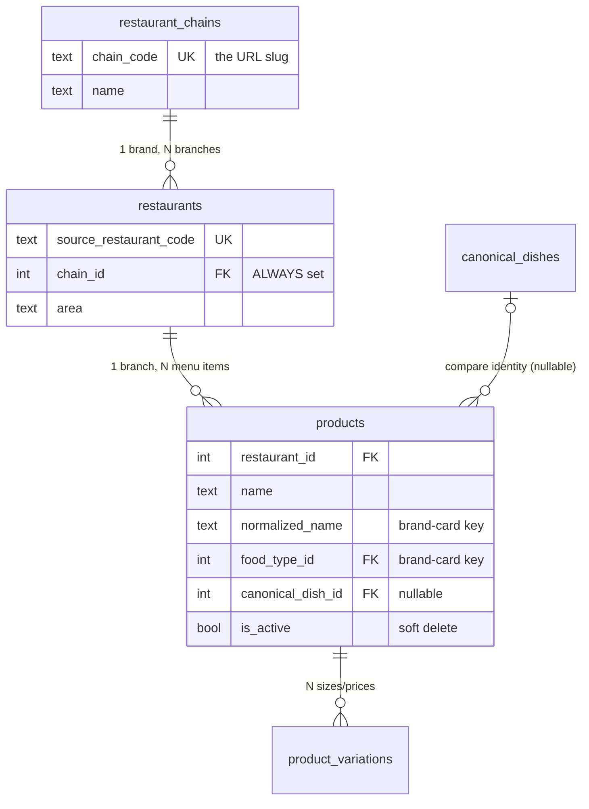

# Khawon Backend — Primer

**5-minute read.** The mental model and the schema map. Everything here is verified against the live database (2026-07-17).

Need more? [`ARCHITECTURE.md`](ARCHITECTURE.md) — every column, every algorithm, worked examples. [`HANDOFF.md`](HANDOFF.md) — how to run it + the debugging traps.

---

## The five nouns

| Term | Table | Is | Count |
|---|---|---|---:|
| **Brand** | `restaurant_chains` | What a diner recognizes: *Domino's Pizza*. **In the API, "restaurant" means brand.** | 378 |
| **Branch** | `restaurants` | One outlet: *Domino's - Dhanmondi*. Has coords, address, its own foodpanda rating. | 451 |
| **Product** | `products` | One menu item **at one branch**: *Margherita at Domino's Dhanmondi, 348tk*. | 16,385 |
| **Variation** | `product_variations` | A size/price point on one product: *Large — 649tk*. | 20,643 |
| **Canonical dish** | `canonical_dishes` | A compare identity **across brands**: *French Fries, sold by 61 brands*. | 1,431 |

Plus one thing that is **derived, never stored** — and has **no table**:

> **Brand dish card** — a brand's branches collapsed into one menu entry: *Margherita, 199–348tk, at 3 of 3 branches*. Built per request from `products` rows. 13,653 of them, from 16,385 products.



---

## Q: What's the difference between a restaurant and a brand?

A **brand** is the name; a **branch** is the building. Domino's is one brand with three branches. The confusing part: the table called `restaurants` holds **branches**, while the table called `restaurant_chains` holds **brands** — and the API word "restaurant" means **brand**. So `GET /restaurants` returns 378 brands, not 451 branches.

*(Both names are historical. `restaurant_chains.chain_code` doesn't hold foodpanda's chain code either — it holds our own derived slug.)*

## Q: Why is every restaurant a brand, even a solo one?

Because the alternative is `if chain else standalone` in **every single query**. A standalone restaurant is *a brand of one* (`branch_count == 1`), so every rule is a plain `GROUP BY chain_id` with zero special-casing — and a solo restaurant's card, page, and menu are shape-identical to a chain's.

`restaurants.chain_id` is never NULL. **Keep it that way.**

## Q: Why is Domino's one row instead of three?

Because three identical Margheritas in a search result is noise, not choice. At read time we group products by **`(chain_id, food_type_id, normalized_name)`** and emit one card. ~17% of the raw catalogue is chain duplication — 16,385 products collapse to 13,653 cards.

`food_type_id` is in that key for a reason: without it, a brand's "Chicken" *curry* fuses with its own "Chicken" *pizza*.

The menu is the **union** of all branches' menus, badged *"at 2 of 3 branches"*. Intersection would hide ⅓ of Domino's menu; union with no badge would send someone across town for a pizza their branch doesn't sell.

## Q: What's a canonical dish?

The answer to *"who else sells this exact dish, and for how much?"* It's the identity that lets **different brands'** dishes be recognized as the same food.

A name group becomes canonical only when **2+ different brands** sell it. Brands, not branches — a drink sold at 3 branches of one chain isn't comparable across restaurants, because nobody else makes it. (Counting branches instead of brands was a real bug: it inflated canonical dishes to 2,527. Fixing it gave 1,431.)

Dishes only one brand sells stay `canonical_dish_id = NULL`. **They're not lost** — still fully searchable and browsable. They just aren't offered as a comparison.

## Q: Isn't that just a food sub type?

**No — different jobs, and the numbers show it.** This is the distinction people get wrong most often.

| | Food Sub Type | Canonical dish |
|---|---|---|
| **Job** | **Browsing** — "show me biryanis" | **Comparing** — "who sells Chicken Biryani, for how much" |
| **Design goal** | deliberately **coarse** | deliberately **specific** |
| **Count** | 111 | 1,431 |
| **Example** | `Rice / Biryani-Kacchi` | `Chicken Biryani`, `Beef Biryani`, `Mutton Kacchi`… |

One sub type **contains dozens of canonical dishes**. That's the whole relationship: sub type is a shelf, canonical dish is the product on it.

**Why you can't compare on sub type:** comparing everything tagged `Rice/Biryani-Kacchi` across restaurants puts *Chicken Biryani* at one place next to *Beef Kacchi* at another and calls the price difference meaningful. It isn't — they're different foods. Comparison needs the *specific dish*; browsing needs the *coarse bucket*. Neither can do the other's job, so both exist.

> ⚠️ **Live bug (2026-07-17):** `food_sub_type_id` is **NULL on all 16,385 products and all 1,431 canonical dishes**. The 111 sub-type rows exist but nothing links to them, so `GET /food-types/{id}/sub-types` returns every sub type with `dish_count: 0`. Cause: `load_batch.py` builds its lookup keyed `(food_type_id, name)` but reads it with `(food_type_name, name)` — the `.get()` silently returns None. Sub-type browsing is currently non-functional. Canonical dishes are unaffected.

## Q: Why do canonical dishes need to exist at all — why not just match names?

Because the same dish is spelled differently everywhere. `canonical_match_key()` normalizes: strips sizes (`Half`, `500gm`), applies a spelling map (`biriyani`→`biryani`, `pulao`→`polao`), drops stopwords, and sorts tokens — so *"Chicken Biryani"* and *"Biryani with Chicken"* land on the same key.

That one function is imported by **three** layers (consolidation, brand cards, canonical dishes), which is what makes them agree on what "the same dish name" means. **Extend its `SPELLING_MAP` and all three inherit the fix.**

## Q: Where's the brand-card table?

There isn't one, deliberately. The card is a **grouping** over `products` rows, computed per request. Same for pooled ratings, price ranges, and availability badges — nothing is denormalized.

Why: no cache to invalidate, no stale aggregate, no rebuild job. Correct by construction.

⚠️ Consequence: **`products.rating` and `restaurants.rating` are reserved and NOT maintained — don't read them.** Ratings compute live from *approved* reviews.

## Q: Why do URLs use slugs instead of ids?

`/restaurants/bella-italia`, never `/restaurants/296`. Two reasons:

1. `restaurants.id` and `restaurant_chains.id` are **separate sequences that overlap**. `/restaurants/296` once served *Bella Italia* (chain 296) when handed branch row 296 (*Pizzolo Caffe*) — a silent wrong-restaurant bug with **no 404 to catch it**. A slug can't be mistaken for either id space.
2. Serial ids **churn on every pipeline reload** (canonical dishes are wiped and rebuilt). Slugs survive, so links stay valid.

Numeric `/restaurants/{int}` **404s by design**. Use `slug` in URLs; ids belong in POST bodies only.

---

## The 20 tables at a glance

**Core** — where you'll spend your time (details in [`ARCHITECTURE.md` §2](ARCHITECTURE.md)):

| Table | Holds |
|---|---|
| `restaurant_chains` | Brands. `chain_code` = the URL slug. |
| `restaurants` | Branches. `chain_id` always set; `old_rating` = foodpanda's. |
| `products` | One menu item at one branch. `normalized_name` + `food_type_id` = the brand-card key. `is_active` = soft delete. |
| `product_variations` | Size/price points. `label` defaults `'Regular'`, never NULL. |
| `canonical_dishes` | Cross-brand compare identity. **Wiped and rebuilt every load** — never store its id. |

**Taxonomy** — 4 independent dimensions on every product:

| Table | Rows | |
|---|---:|---|
| `food_categories` | 6 | Meal role: Breakfast / Main Dish / Appetizer / Sides / Dessert / Drinks |
| `food_types` | 28 | Coarse browse umbrellas: Rice, Curry, Pizza, Set Menu… |
| `food_sub_types` | 111 | Per-type differentiator ⚠️ *currently unlinked — see the bug above* |
| `cuisines` | 11 | Bangladeshi, Italian… ("Asian" = pan-Asian only, not a dumping ground) |
| `flavor_tags` | 9 | Multi-label: cheesy, smoky_bbq… (14,857 product links) |

**Joins:** `restaurant_cuisines` · `product_flavor_tags` · `restaurant_sources` *(defined, unused)*

**Users & reviews** — two parallel stacks, both **0 rows** (pre-launch):

| Table | |
|---|---|
| `users` | bcrypt; `display_name` is aliased `username` in the API |
| `restaurant_reviews` | The **experience at a branch**. Pooled per brand for display. |
| `product_reviews` | The **dish at a branch**. |
| `*_review_photos`, `*_review_votes` (×4) | Schema-ready, no endpoints yet |

Both stacks: account required, one review per user per target (resubmitting updates), post-moderation (insert `approved`, reads filter `approved`).

---

## Worked example: Margherita

**In the scrape** — 3 branches, 3 separate product rows:

```
Domino's Pizza - Dhanmondi         Margherita   348tk
Domino's Pizza Gulshan             Margherita   348tk
Domino's Pizza - Jashimuddin Ave   Margherita   199tk
```

**Pipeline:** all 3 branch names strip their area → `domino-s-pizza` → **1 brand, 3 branches**. All 3 products get `normalized_name = "margherita"`, `food_type = Pizza`. Two other brands sell the same key → 3 brands ≥ 2 → **promoted to canonical dish 14449**.

**On request** (`GET /restaurants/domino-s-pizza/menu`) — group by `(chain_id, Pizza, "margherita")` → all 3 collapse into **one card**:

```
Margherita · 199–348tk · Domino's Pizza
price_varies: true    branch_count: 3    brand_branch_total: 3  (badge suppressed)
```

One card, not three — **and the price range is real**: Uttara sells it 43% cheaper. The dedupe surfaced that, it didn't hide it.

**In compare** (`GET /dishes/compare/14449`) Domino's is **one row** with `branch_count: 3`, next to every other brand's Margherita. That's the product.

> ⚠️ Margherita is also the best example of the system's ceiling: it exists as **four** canonical dishes — `Margherita` (3 brands), `Margherita Pizza` (12), `Classic Margherita` (2), `Classic Margherita Pizza` (4) — because `margherita` vs `margherita pizza` scores 0.769 against a 0.92 fuzzy threshold. Same dish, four comparison identities. The dedupe works; the **matching** is what leaves value on the table. See [`ARCHITECTURE.md` §3.3](ARCHITECTURE.md).
