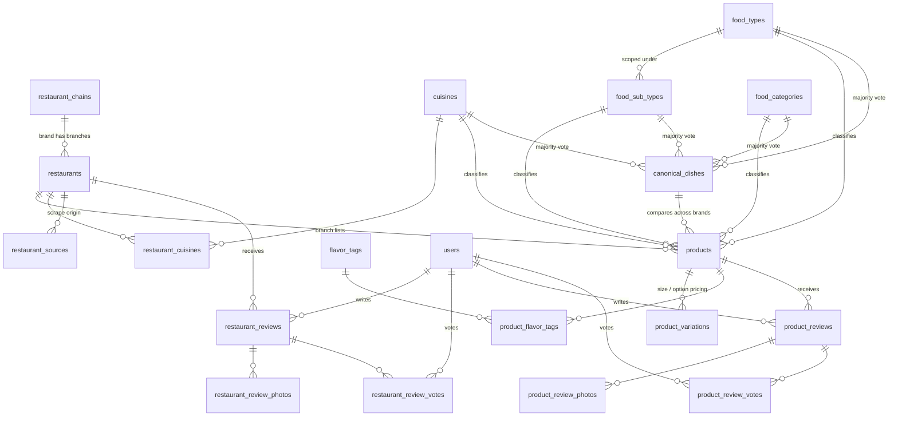
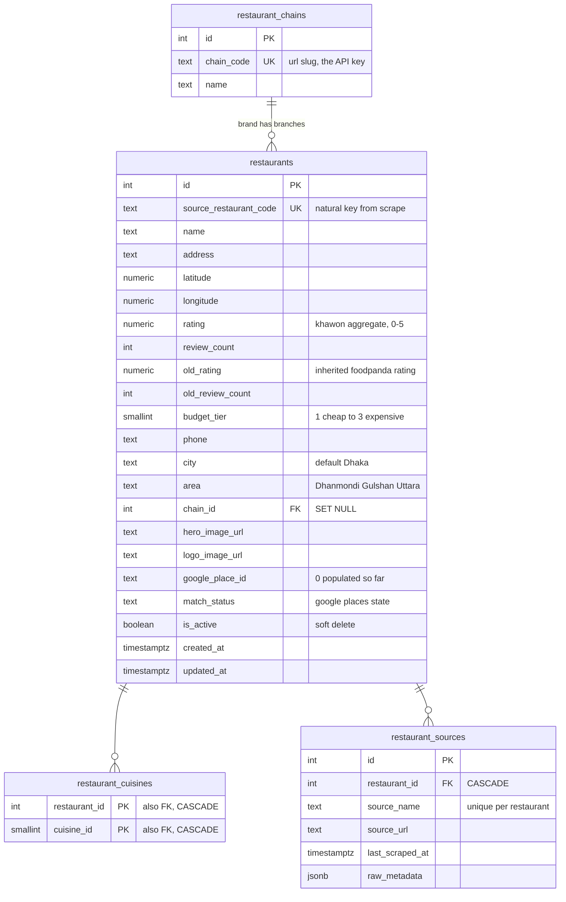
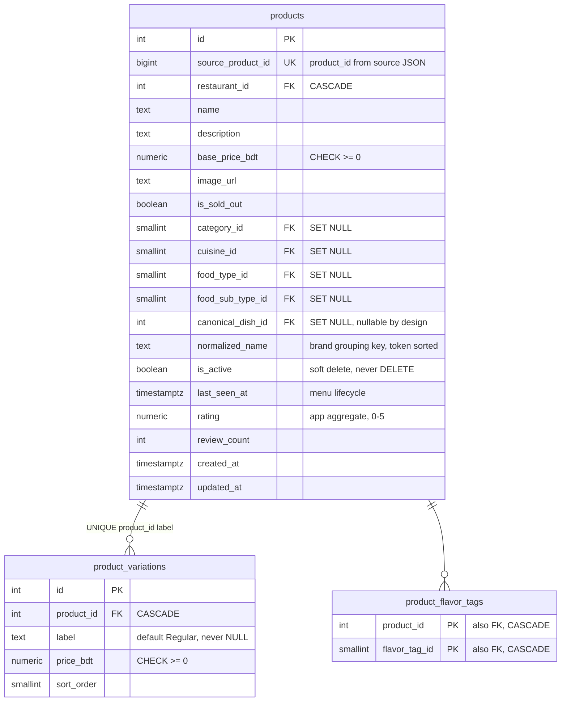
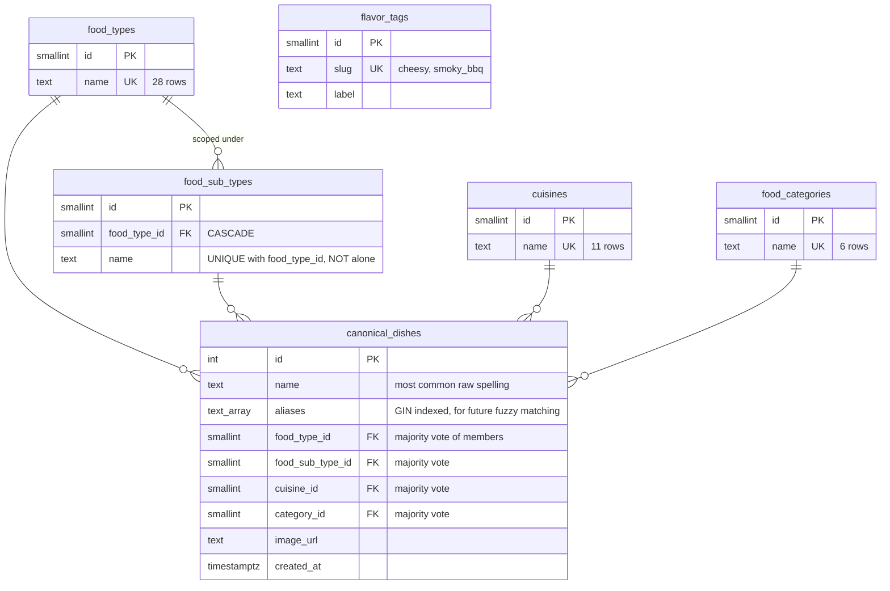
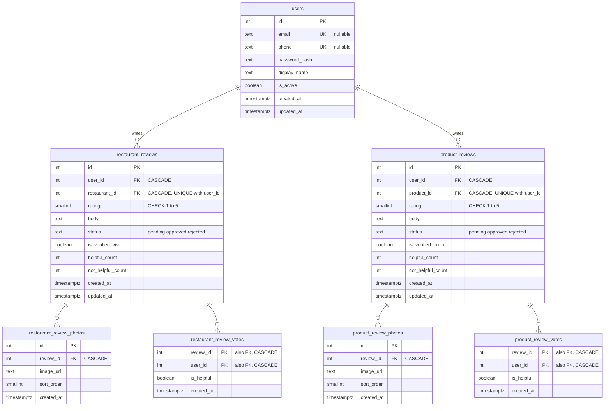

# Khawon Database Schema

**20 tables, 3 views, PostgreSQL 18.** Source of truth is [`schema.sql`](../schema.sql) — not the ORM.

Every count, name and example below was queried from the live database on 2026-07-23. Nothing here is illustrative or invented.

| | |
|---|---|
| Branches (`restaurants`) | 451 |
| Brands (`restaurant_chains`) | 378 |
| Products | 16,385 active |
| Canonical dishes | 1,431 |
| Product variations | 20,643 |
| Flavor tag links | 14,857 |
| Users / reviews | 0 — pre-launch |

---

## 1. Read this first: two grouping layers that stack

Both answer "are these the same dish?" — for different reasons, at different scopes. They were conflated once and it cost real accuracy: `canonical_dishes` used to promote on "2+ restaurants", which counted *branches*, so a chain-exclusive drink at three branches of one chain looked comparable across restaurants when nobody else makes it. Fixing it dropped canonical dishes 2,527 → 1,431.

| | Chain grouping | Canonical dishes |
|---|---|---|
| **Job** | Dedupe *within* one brand | Compare *across* brands |
| **Scope** | intra-brand | inter-brand |
| **Stored?** | **No** — derived at read time | Yes, a real table |
| **Key** | `(chain_id, food_type_id, normalized_name)` | `(food_type, normalized_name)`, 2+ brands |
| **Live example** | Domino's `margherita`, 3 branch rows → 1 card, 199–348tk | French Fries: **61 brands**, 69 products, 76–410tk |

### Vocabulary

- **Brand** = a `restaurant_chains` row. **In the API, "restaurant" means brand.**
- **Branch** = a `restaurants` row, one physical outlet.
- **Every restaurant has a brand** — a standalone place is a brand of one. That invariant is load-bearing: every brand rule is a plain `GROUP BY chain_id` with zero special-casing.

### Chain grouping in the real data

| Brand | `normalized_name` | Collapses | Price range |
|---|---|---|---|
| Domino's Pizza | `margherita` | 3 → 1 | 199–348tk |
| Domino's Pizza | `mexicana veggie` | 3 → 1 | 299–448tk |
| Shumi's Hot Cake | `black cake forest` | 3 → 1 | 990–2390tk |

Note `black cake forest` — the key is **token-sorted**, so word order stops mattering.

---

## 2. Entity relationships (connections only)

**What isn't drawn: chain grouping.** It has no foreign key because it isn't stored — the API derives it per request from `products.normalized_name`.

---

## 3. One real row, resolved through every foreign key

A single `products` row with all seven references followed.

**`BBQ Chicken Cheese Burger`** — 208tk

| Resolves to | Value |
|---|---|
| `products.normalized_name` | `bbq burger cheese chicken` — tokens sorted alphabetically. The brand-grouping key. |
| → `restaurants` | Pizza Lover · Gulshan *(the branch)* |
| → `restaurant_chains` | Pizza Lover · slug `pizza-lover` *(the brand, and the URL key)* |
| → `food_types` | Burger |
| → `food_sub_types` | Chicken *(scoped under Burger — see §6)* |
| → `cuisines` | Western/Continental |
| → `food_categories` | Main Dish |
| → `product_flavor_tags` | `smoky_bbq`, `cheesy` *(two rows in the join table)* |
| → `canonical_dishes` | BBQ Chicken Cheese Burger *(what makes it comparable across brands)* |

Seven lookups. That's why `v_product_detail` exists — it pre-joins exactly this set.

---

## 4. Brands & branches

- **`restaurant_chains`** (378) — the brand. `chain_code` is the API's URL key, **not** the id; the two id sequences overlap, which used to serve the wrong brand for a numeric lookup.
- **`restaurants`** (451) — a branch. `rating` is Khawon's own; `old_rating` is the inherited foodpanda number used as fallback.
- **`restaurant_cuisines`** (409 links) — fewer links than branches, so some branches carry no cuisine.
- **`restaurant_sources`** — **0 rows, unused.** The table exists but `load_batch.py` never populates it. Either wire it up or drop it.

---

## 5. Products & menus

One `products` row = one menu item at **one branch**. The same dish at three branches is three rows.

`canonical_dish_id` is **nullable by design** — a dish sold at only one restaurant stays unlinked and is still fully searchable, just not compared.

**`product_variations`** (20,643 — more rows than products). `label` defaults to `'Regular'` and is never NULL, because Postgres treats NULL as distinct from NULL, so a nullable label would silently permit duplicate default rows.

Real example — Margherita Pizza @ Pizza On Fire: 6″ 249tk · 9″ 399tk · 12″ 599tk · 16″ 799tk

### ⚠️ Never hard-delete a product

`product_reviews` cascades on delete. A re-scrape that no longer sees an item must set `is_active = FALSE`, never `DELETE` — otherwise a dish that's temporarily off the menu takes every user review with it. That's why `is_active` and `last_seen_at` exist.

---

## 6. Taxonomy — four independent dimensions

These are **not** a hierarchy. Only `food_type → food_sub_type` nests; cuisine, category and flavor are orthogonal to it and to each other.

**`food_types`** (28) — Bangladeshi Sides · Beverages · Bread · Burger · Condiments · Curry · Dessert · Egg Dishes · Fried · Fried Bites · Fries · Grill · Kebab · Meat Box · Momo/Dumpling · Noodles/Chowmein · Pasta · Pizza · Ramen · Rice · Salad · Sandwich · Set Menu · Soup · Steak · Sushi · Taco · Wraps & Rolls

**`cuisines`** (11) — Asian · Bangladeshi · Chinese · Italian · Japanese · Korean · Middle Eastern · South Asian/Indian · Thai · Turkish · Western/Continental

**`food_categories`** (6) — Appetizer · Breakfast · Dessert · Drinks · Main Dish · Sides

**`flavor_tags`** (9) — buttery · cheesy · creamy · garlicky · peri_peri · smoky_bbq · spicy · sweet · tangy. The only many-to-many dimension.

### Why the sub-type key must be composite

Every row is one name existing as **multiple distinct sub-type rows**, one per parent. Keying a lookup on the name alone silently collapses them — the exact bug that once left `food_sub_type_id` NULL on all 16,385 products.

| Sub-type name | Rows | Parent food types |
|---|---|---|
| Chicken | **11** | Burger, Curry, Fried, Grill, Meat Box, Pasta, Pizza, Salad, Sandwich, Soup, Steak |
| Beef | 9 | Burger, Curry, Grill, Pasta, Pizza, Salad, Sandwich, Soup, Steak |
| Fish | 3 | Curry, Fried, Grill |
| Fried | 3 | Egg Dishes, Momo/Dumpling, Set Menu |
| Seafood | 3 | Pasta, Pizza, Soup |
| Juice | 2 | Beverages, Dessert |
| Paratha | 2 | Bread, Curry |

### Canonical dishes with the widest brand spread

Brand count, not branch count, is what earns a row here.

| Canonical dish | Brands | Products | Price range |
|---|---|---|---|
| French Fries | 61 | 69 | 76–410tk |
| Plain Rice | 45 | 47 | 13–289tk |
| Egg Omelette | 35 | 35 | 17–60tk |
| Alu Bhorta | 33 | 33 | 18–60tk |
| Cappuccino | 28 | 35 | 191–450tk |
| Chicken Cheese Burger | 27 | 30 | 150–468tk |

Sub-type is deliberately **excluded** from the canonical grouping key: the classifier tags Beef Tehari as Tehari at one restaurant and Biryani at another, which would fragment the group.

---

## 7. Users & the two review stacks

Two parallel, structurally identical stacks — one for **branches**, one for **products** — each with photos and helpfulness votes.

- **`users`** — email *or* phone required, enforced by a table CHECK; both nullable individually, both unique.
- **`restaurant_reviews`** — brand-level ratings pool these across branches at read time.
- **`product_reviews`** — the differentiating feature; the thing foodpanda and Maps don't have.
- **`*_review_votes`** — `PK (review_id, user_id)` makes double-voting structurally impossible rather than something the app must remember to check.

Ratings are computed on read from **approved** reviews only. The stored `rating` / `review_count` columns on `restaurants` and `products` are app-maintained aggregates.

---

## 8. What happens on delete

The rule, applied consistently: **ownership cascades, classification nulls out.** Deleting a thing removes what belongs to it; deleting a label never removes what it labelled.

| Delete this | Behavior | And this happens |
|---|---|---|
| `restaurants` | `CASCADE` | its products, cuisine links, sources and reviews all go |
| `products` | `CASCADE` | variations, flavor links and **every review on the dish** go — use `is_active` instead |
| `restaurant_reviews` | `CASCADE` | its photos and votes go |
| `product_reviews` | `CASCADE` | its photos and votes go |
| `users` | `CASCADE` | all their reviews and votes go |
| `food_types` | `CASCADE` | its sub-types go … |
| `food_types` | `SET NULL` | … but products and canonical dishes survive, unclassified |
| `cuisines` / `food_categories` | `SET NULL` | products and canonical dishes survive, unclassified |
| `canonical_dishes` | `SET NULL` | products survive and stay searchable, just no longer comparable |
| `restaurant_chains` | `SET NULL` | branches survive, orphaned from their brand |

---

## 9. Views

Read-only conveniences that pre-join the taxonomy so callers don't repeat six `LEFT JOIN`s.

| View | Grain | Flattens |
|---|---|---|
| `v_restaurant_summary` | one branch | chain name, cuisine array, active product count, min/max price |
| `v_product_detail` | one product | all four taxonomy dimensions as names, canonical dish, restaurant, flavor array |
| `v_canonical_dish_comparison` | one product per dish | the core "search a dish, compare it" query — active products at active restaurants |

---

## Extensions & portability

`pg_trgm` is required — fuzzy/substring name search is the core feature. **PostGIS is not used**: the generated `geog` column and its GiST index live in the optional [`schema_geo.sql`](../schema_geo.sql), applied only on a PostGIS-enabled host when building "near me". Raw `latitude`/`longitude` stay in the core schema regardless.

Changing a column means editing **both** `schema.sql` *and* adding a numbered file in [`migrations/`](../migrations/). See that directory's README for the convention.
